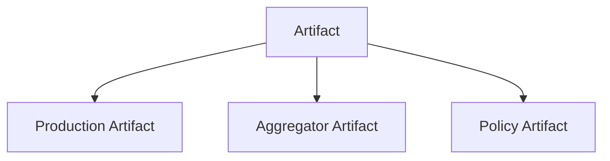
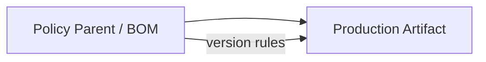
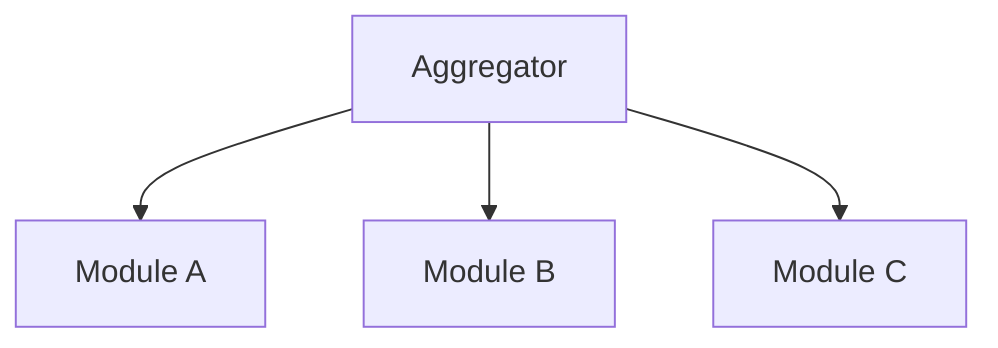
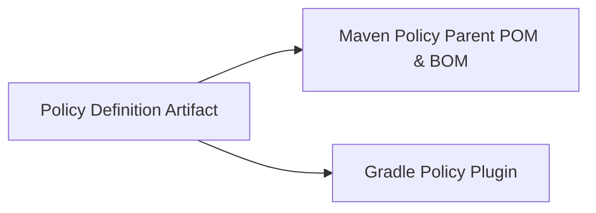

[[PROPOSAL]]
# Algites Development Structure Specification
**Version:** 2.0-draft
**Status:** Consolidated proposal
**Scope:** All repositories, logical artifacts, source structures, technology kinds, source types, publication outputs, and dependency models within the Algites ecosystem

## 1. Introduction

---

## 2. Namings

### 2.1. Purpose

This document defines a unified structural and naming standard for:

- source repositories,
- logical Algites artifacts,
- technology-specific publication outputs and coordinates,
- source directory kinds and generated-source conventions,
- and related identifiers

across the Algites platform, tools, libraries, products, and customer solutions.

The goals are:

- **Semantic clarity** – names must express domain and purpose.
- **Consistency** – the same concepts are named the same way everywhere.
- **Uniqueness** – artifacts must be identifiable without collisions.
- **Scalability** – the standard must support long-term growth.
- **Governance visibility** – public vs private scope must be immediately visible where needed.

---

### 2.2. Terminology

- **Visibility** – governance scope of a repository or artifact (`pub` or `priv`).
- **Role** – technical role of a repository or artifact (`pltf`, `app`, `lib`, `tool`, `frmw`, etc.).
- **BusinessName** – PascalCase domain or product/application concept (e.g., `Modustro`, `MyGreatProduct`).
- **RepoSubname** – optional lowercase technical qualifier of a repository (e.g., `common`, `core`, `backend`).
- **Module Path** – dot-separated identifier of a module or component within a repository.
  It consists of zero or more **module path folders** followed by a mandatory **module root folder**:
  `[<folders>.]<moduleroot>` (e.g., `mymodule.blfacadeintf`, `tools.profiler`, `build.parent`).
- **Module Root Folder** – the last segment of the module path that identifies the primary module name.
- **Variant** – a suffix identifying a specialized flavor of a module (e.g., `tests`).
- **Artifact** – a logical, modeled buildable unit. One artifact MAY support multiple build technologies and MAY produce multiple technology-specific outputs.
- **ArtifactCoordinateId** – the stable Algites identity of a logical artifact. It is independent of ecosystem-specific publication coordinates such as Maven GAV or a Python distribution name.
- **StructureKind** – the structural role of a resolved metadata node: `repository`, `artifact-set`, or `artifact`. It describes where the node belongs in the source-repository structure and is independent of build technology.
- **TechnologyKind** – a supported build/publication technology (for example `java`, `python`, or `mps`). Technology kinds are registry-/enum-like, deliberately few, and not arbitrary free-form strings. The name describes the technology/build nature of the artifact and is distinct from artifact roles such as Core, Aggregator, Policy, or BOM.
- **SourceType** – a semantic type of source directory below `src/product` or `src/develop` (for example `java`, `python`, `xmldefs`, `yamldefs`, `config`, or `resources`). Source types are a broader classification than technology kinds and do not automatically select a build/publication technology.

---

### 2.3. Repository Naming

#### 2.3.1 Canonical Form

Repositories MUST be named using the following structure:

```
<vis>.<role>.<BusinessName>[.<reposubname>]
```

Where:

- `<vis>` = `pub` | `priv` (lowercase)
- `<role>` = technical role (lowercase)
- `<BusinessName>` = PascalCase business or domain name
- `<reposubname>` = optional lowercase technical qualifier

#### 2.3.2 Case Rules

- `vis` and `role` MUST be lowercase.
- `BusinessName` MUST be PascalCase.
- All `reposubname` components MUST be lowercase.

#### 2.3.3 Examples

```
pub.pltf.Modustro
priv.app.Modustro
priv.lib.Customers.common
pub.tool.Java
priv.tool.Java
```

---

### 2.4. Logical Artifact Naming (`artifactCoordinateId`)

#### 2.4.1 Canonical Form

Each logical `artifactCoordinateId` MUST be composed of:

```
<vis>.<role>.<BusinessName[.reposubname]>_<module.path>[-<variant>]
```

Where:

- the part before `_` identifies the **repository root**,
- the part after `_` identifies the **module within the repository**,
- `<module.path>` follows the form `[<folders>.]<moduleroot>`,
- `-<variant>` is an OPTIONAL suffix identifying a variant of the module root (e.g., `tests`),
- `_` is a mandatory separator between repository identity and module path.

#### 2.4.2 Case Rules

- `<vis>`, `<role>`, `<reposubname>`, all module path folders, module root, and `<variant>` MUST be lowercase.
- `<BusinessName>` MUST preserve PascalCase from the repository name.
- The underscore `_` MUST be used exactly once in the `artifactCoordinateId`.
- The variant suffix, if present, MUST be appended using `-`.

#### 2.4.3 Examples

From repository:

```
pub.pltf.Modustro
```

Artifacts:

```
pub.pltf.Modustro_core
pub.pltf.Modustro_languages
pub.pltf.Modustro_mps.plugin
```

From repository:

```
priv.lib.Customers.common
```

Artifacts:

```
priv.lib.Customers.common_aaa.blfacadeintf
priv.lib.Customers.common_aaa.blfacadeintf-tests
priv.lib.Customers.common_aaa.other
```

From repositories:

```
pub.tool.Java
priv.tool.Java
```

Artifacts:

```
pub.tool.Java_build.parent
pub.tool.Java_tools.profiler

priv.tool.Java_build.parent
priv.tool.Java_tools.profiler
```

---

### 2.5. Java/Maven `groupId` Mapping

#### 2.5.1 Canonical Form

For the Java/Maven publication mapping, `groupId` MUST follow:

```
eu.algites.<role>.<businessname-lc>[.<reposubname>]
```

Where `<businessname-lc>` is the lowercase form of the BusinessName.

#### 2.5.2 Case Rules

All groupId components MUST be lowercase.

#### 2.5.3 Visibility Rule

Visibility (`pub` | `priv`) MUST NOT be part of the groupId.

The groupId expresses only the **business and technical domain**, not governance.

#### 2.5.4 Examples

```
eu.algites.pltf.modustro
eu.algites.app.modustro.studio
eu.algites.lib.customers
eu.algites.lib.customers.common
eu.algites.tool.java
```

---

### 2.6. Visibility and Artifact Identity

Visibility represents **governance and distribution scope**.

#### 2.6.1 Rules

Visibility MUST:

- be part of the **repository name**,
- be part of the **artifactCoordinateId**,
- influence CI/CD and publishing targets.

Visibility MUST NOT:

- be part of the **groupId**.

#### 2.6.2 Rationale

Including visibility in the logical artifact identity provides:

- immediate visual distinction in dependency trees and logs,
- early detection of accidental use of private artifacts in public builds,
- clear auditability of logical artifact identities and technology-specific outputs.

---

### 2.7. Variant Suffix Rules

#### 2.7.1 Purpose

Variants represent specialized flavors of a module root that are published as independent artifacts,
most notably shared test artifacts. It SHOULD be used whenever products that would otherwise be
distinguished only by a build classifier require their transitive dependencies to be tracked and
resolved by Maven/Gradle.

#### 2.7.2 Reserved Variants

The following variant suffixes are RESERVED:

- `tests` – shared tests for the base module root.

Additional variants (e.g., `it`, `bench`) MAY be introduced if documented.

#### 2.7.3 Terminal Rule

Artifacts with variant suffix `-tests` MUST be terminal:

- They MUST NOT define or publish further variants.
- In particular, `*-tests-tests` MUST NOT exist.

This prevents recursive test variants and aligns with Maven idioms where `-tests` denotes a test flavor.

#### 2.7.4 Rationale

The `-tests` suffix intentionally mirrors the common Maven convention
`<artifactId>-tests-<version>.jar` used for test classifiers, while elevating it to a
first-class artifact to enable transitive sharing of test dependencies.

---

### 2.8. Mapping Rules

#### 2.8.1 From Repository to Artifact Root

Given repository:

```
<vis>.<role>.<BusinessName>[.<reposubname>]
```

Artifact root becomes:

```
<vis>.<role>.<BusinessName>[.<reposubname>]
```

and the `artifactCoordinateId` is completed by appending:

```
_<module.path>[-<variant>]
```

#### 2.8.2 From BusinessName to groupId

BusinessName is normalized to lowercase:

```
Modustro -> modustro
Customers -> customers
Java -> java
```

---

### 2.9. Technology-Specific Publication Naming

The logical `artifactCoordinateId` is technology-neutral. Each TechnologyKind maps that logical identity to the native coordinates and package names of its ecosystem. The mapping MUST be deterministic and defined by the corresponding TechnologyKind adapter. Ecosystem-specific identities that are deterministically derivable MUST NOT become independent sources of truth in Algites metadata.

#### 2.9.1 Java/Maven publication naming

For Java/Maven publications, the Maven `artifactId` is the logical `artifactCoordinateId` unless a documented output-specific mapping requires an additional suffix or classifier. The resulting JAR file name follows Maven convention:

```text
<artifactCoordinateId>-<version>.jar
```

Examples:

```text
pub.pltf.Modustro_core-1.2.0.jar
priv.lib.Customers.common_bai.blfacadeintf-1.0.0.jar
priv.lib.Customers.common_bai.blfacadeintf-tests-1.0.0.jar
pub.tool.Java_build.parent-1.4.0.jar
```

The Java/Maven `groupId` is derived independently according to section 2.5.

#### 2.9.2 Python distribution/project naming

Python uses one distribution/project name rather than a Maven-style `groupId` + `artifactId` pair. Algites therefore derives a globally Algites-namespaced Python distribution name directly from `artifactCoordinateId`.

The normative mapping is:

```text
pythonDistributionName = "algites-" + normalizePythonProjectName(artifactCoordinateId)
```

where `normalizePythonProjectName`:

1. converts ASCII letters to lowercase, and
2. replaces every contiguous run of `.`, `_`, or `-` with one `-`.

The generated Algites Python distribution name MUST already be in this canonical normalized form and MUST be used consistently for Python project metadata and repository lookup. No separate Python equivalent of Maven `groupId` is defined.

Example:

```text
artifactCoordinateId:
priv.lib.Customers.common_aaa.blfacadeintf-tests

Python distribution/project name:
algites-priv-lib-customers-common-aaa-blfacadeintf-tests
```

The `algites-` prefix is an ecosystem namespace prefix, not a DNS-derived group identifier. The Maven `eu.algites...` groupId MUST NOT be prepended to the Python distribution name.

#### 2.9.3 Python import namespace

The Python import namespace is distinct from the distribution/project name. It MUST preserve Algites governance visibility so that public and private artifacts cannot install into the same derived namespace.

The canonical namespace is derived as follows:

```text
algites.<vis>.<role>.<businessname-lc>[.<reposubname>].<module-path>
```

Rules:

- `algites` is the mandatory root package namespace;
- repository identity components, including `pub` or `priv`, are preserved as lowercase package segments;
- the module path is preserved as lowercase package segments;
- an optional Algites artifact variant such as `-tests` is appended to the final module-root package identifier using `_`, e.g. `blfacadeintf_tests`, so that a variant does not collide with a real child package named `tests`;
- every resulting package segment MUST be a valid Python identifier. If the deterministic mapping produces an invalid identifier, validation MUST fail rather than silently inventing a different namespace;
- shared parent packages below the common `algites` root MUST use Python namespace-package-compatible layout so multiple independently published Algites distributions can contribute descendants without owning/conflicting parent-package files. The Python adapter MUST NOT generate conflicting shared-parent `__init__.py` files.

Examples:

```text
artifactCoordinateId:
priv.lib.Customers.common_aaa.blfacadeintf

Python import namespace:
algites.priv.lib.customers.common.aaa.blfacadeintf
```

```text
artifactCoordinateId:
priv.lib.Customers.common_aaa.blfacadeintf-tests

Python import namespace:
algites.priv.lib.customers.common.aaa.blfacadeintf_tests
```

The corresponding public artifact would use `algites.pub...`, not the private namespace.

#### 2.9.4 Cross-ecosystem mapping example

For the logical artifact:

```text
priv.lib.Customers.common_aaa.blfacadeintf-tests
```

the deterministic identities are:

```text
Algites artifactCoordinateId:
priv.lib.Customers.common_aaa.blfacadeintf-tests

Java/Maven groupId:
eu.algites.lib.customers.common

Java/Maven artifactId:
priv.lib.Customers.common_aaa.blfacadeintf-tests

Python distribution/project name:
algites-priv-lib-customers-common-aaa-blfacadeintf-tests

Python import namespace:
algites.priv.lib.customers.common.aaa.blfacadeintf_tests
```

This example is intentionally asymmetric: Maven has a two-part publication coordinate, while Python has one distribution/project name plus an independent import namespace. Both are projections of the same Algites identity.

#### 2.9.5 Generated `pyproject.toml`

The effective Python project descriptor is derived development/build metadata. Its Algites-owned values MUST be generated from the resolved Algites model rather than duplicated manually.

For a Python-capable artifact:

- `pyproject.toml` is the effective generated descriptor placed in the artifact root for compatibility with Python tooling and IDEs;
- generated `pyproject.toml` MUST NOT be committed to VCS and SHOULD be covered by repository ignore rules;
- the generated `[project].name` MUST equal the Python distribution/project name from section 2.9.2;
- version and dependency metadata that are owned by the Algites model MUST likewise be generated from the resolved effective model;
- an optional committed `pyproject.toml.tpl` MAY provide Python-specific settings that are not otherwise deterministically owned by Algites, for example `[tool.*]` configuration or adapter-supported build-backend settings;
- the template MUST NOT override Algites-owned derived identity, version, or dependency values. The TechnologyKind adapter defines deterministic merge rules and MUST fail on conflicting definitions rather than choosing one silently.

The generated descriptor is a working/development artifact, not an independent source of project identity.

#### 2.9.6 Other TechnologyKinds

Every additional TechnologyKind MUST define its own deterministic publication-coordinate mapping before it can be declared in `technologyKinds`. Unknown or unsupported TechnologyKinds are validation errors.

### 2.10. Generated Documentation Location

#### 2.10.1 Purpose

Generated documentation for repository artifacts SHOULD be placed under a dedicated documentation site root.

This standard defines only the logical directory structure of generated documentation. It does not prescribe a concrete hosting mechanism. The same structure may be published using GitHub Pages, an internal web server, an artifact repository, or any other static documentation hosting solution.

#### 2.10.2 Canonical Form

Generated documentation for an artifact SHOULD use the following canonical structure:

```text
<docs-site-root>/generated/artifacts/<module.local.id>/<documentation-channel>/
```
The channel directory contains the artifact-level `index.html`. Technology-specific documentation MUST always be placed below that channel in a subdirectory identified by TechnologyKind, for example `java/`, `python/`, or `mps/`, even when only one TechnologyKind is documented. The stable TechnologyKind directory keeps the canonical path unchanged when another technology is added later and allows one logical artifact/version to aggregate several technology-specific documentation outputs without inventing separate logical artifact identities.

Documentation generation uses the same TechnologyKind selection semantics as construction and publication. The artifact metadata declares the supported `technologyKinds`; an optional requested TechnologyKind set selects the technologies for the current documentation build. The effective documentation set for an artifact is `declared ∩ requested`. If no requested set is supplied, all declared TechnologyKinds are requested. Only effective TechnologyKinds are emitted into the generated publication; previously generated TechnologyKind directories outside the current effective set MUST be removed from that publication so that the site represents the current documentation build rather than a union of historical partial builds.

The artifact-level `index.html` MUST retain the logical artifact identity (`groupId`, `artifactId`, and logical version), list all declared TechnologyKinds, and separately list only the TechnologyKinds requested/effective for the documentation build. Technology-specific sections MAY additionally expose ecosystem-specific publication identities such as Maven coordinates, Python distribution/import names, MPS module identity, or resulting artifact filenames. Shared documentation provenance SHOULD include the requested source ref/branch, exact source commit, and generation date/time at the logical-artifact publication level; these values need not be duplicated into per-TechnologyKind metadata files.

The standard Python documentation adapter uses Sphinx with Sphinx AutoAPI over Algites Python product source roots (`src/product/python` and `src/product/python.gen`). The adapter generates its static site below the canonical `python/` TechnologyKind directory without importing the documented project as part of API discovery.

Also there is generated an additonal index with following publication agnostic generated path structure:

```text
<docs-site-root>/generated/publications/<documentation-channel>/index.html
```

Meaning of the fields is:

- `<docs-site-root>` is the repository-local root directory for generated documentation site content,
- `generated` is the root of generated documentation, which can be potentially removed and regenerated without impacting the manually created documentation. This folder should never contain manually created documentation.
- `<module.local.id>` is the same local module id used in the `artifactCoordinateId` after the mandatory `_` repository separator,
- `<documentation-channel>` identifies the published documentation view. it consists from <publication-kind>/<publication-id>
- `<docs-site-root>/generated/publications/<documentation-channel>/index.html` - contains the index generated dynamically to point the unique page in the canonical structure

Recommended documentation channels are:

```text
preview/<branch-name>/
snapshots/<snapshot-version>/
releases/<release-version>/
```

#### 2.10.3 Examples

For repository:

```text
pub.lib.Mps
```

and artifacts:

```text
pub.lib.Mps_common.base.mpslang
pub.lib.Mps_common.base.mpssol
```

the generated documentation may be placed below the selected documentation site root as:

```text
<docs-site-root>/
  generated/
    artifacts/
      lang.common.base/
        preview/main/
        snapshots/0.2.0-SNAPSHOT
        releases/0.1.0/

      sol.common.base/
        preview/main/
        snapshots/0.2.0-SNAPSHOT/
        releases/0.1.0/
    publications/
      preview/
        main/index.html
      snapshots/
        0.2.0-SNAPSHOT/index.html
      releases/
        0.1.0/index.html
```

For repository:

```text
pub.lib.Java
```

and artifact:

```text
pub.lib.Java_build.parent
```

the generated documentation may be placed below the selected documentation site root as:

```text
<docs-site-root>/
  generated/
    artifacts/
      build.parent/
        preview/branch_name/
        snapshots/1.5.0-SNAPSHOT/
        releases/1.4.0/
    publications/
      preview/branch_name/index.html
      snapshots/1.5.0-SNAPSHOT/index.html
      releases/1.4.0/index.html
```

#### 2.10.4 Repository Prefix Rule

The repository identity prefix MUST NOT be repeated in the documentation path when the documentation is stored or published within the scope of the same repository.

Therefore, this is preferred:

```text
<docs-site-root>/generated/artifacts/common.base.mpslang/
```

over:

```text
<docs-site-root>/generated/artifacts/pub.lib.Mps_common.base.mpslang/
```

The full `artifactCoordinateId` remains available as metadata inside the generated documentation, together with any technology-specific publication coordinates.

#### 2.10.5 Module Path Reuse

The documentation path SHOULD reuse `<module.local.id>` whcih is derived from the local artifact path in the repository rather than inventing a separate documentation identifier.

This keeps the relationship between repository structure, artifact identity, and generated documentation deterministic:

```text
artifactCoordinateId = <repository-id>_<module.local.id>
docs path            = <docs-site-root>/<module.local.id>/
```

#### 2.10.6 Module Path Disambiguation

If multiple artifacts in the same repository would otherwise have the same logical module name, the module path SHOULD include a disambiguating folder segment.

For example, MPS language and solution artifacts may use:

```text
common.base.mpslang
common.base.mpssol
```

instead of both using:

```text
common.base
```

This is not a technology hierarchy in the documentation site. It is part of the artifact module path and therefore part of the artifact naming model.

#### 2.10.7 Generated Indexes

A documentation site MAY generate repository-level index pages listing all documented artifacts.

Such index pages SHOULD display human-readable module names and MAY omit redundant repository identity from visible labels, while still preserving full artifact coordinates in metadata.

Example display label:
 `common.base.mpslang ` 
with metadata:
 `artifactCoordinateId = pub.lib.Mps_common.base.mpslang
 Java groupId         = <derived-groupId> `
where:
- `<derived-groupId>` is the groupId derived according to section 2.5 using the repository naming rules and the applicable domain prefix.

---

### 2.11. Repository/Artifact Roles (Recommended Set)

Common roles include:

- `pltf` – platform - Algites platform components
- `app` – application - concrete applications
- `lib` – reusable libraries
- `tool` – build and development tools
- `frmw` - framework – generic frameworks
- `lab` – laboratory - experimental or laboratory work

New roles MAY be introduced but MUST be lowercase and documented.

---

### 2.12. Build and Publication Governance

Build and publication automation MUST:

- infer visibility from the repository name prefix (`pub.` vs `priv.`),
- enforce that `artifactCoordinateId` starts with the same visibility prefix and follows the `_` separator rule,
- enforce variant rules, including the terminal nature of `-tests`,
- validate every declared TechnologyKind against the supported TechnologyKind registry,
- resolve the effective publication repository matrix for the selected TechnologyKinds,
- publish each technology-specific output only to a target permitted by repository visibility and the effective publication configuration.

Java/Maven `groupId` remains identical for public and private variants within the same domain. Other TechnologyKinds MUST define equivalent visibility-safe publication mappings in their TechnologyKind adapters.

---

### 2.13. Migration Rule

When migrating legacy projects:

- Preserve BusinessName and structure where possible.
- Align repository names to this standard.
- Artifact identity MUST be adapted to include visibility, the `_` separator,
  and, where applicable, the `-tests` variant suffix.

---

### 2.14. Rationale

This standard balances:

- **Domain identity** (PascalCase BusinessName),
- **Technical structure** (lowercase qualifiers),
- **Practical build compatibility** (lowercase groupId),
- **Governance clarity** (visibility in repository and logical artifact identity),
- **Human auditability** (pub/priv visible in logical identity and technology-kind-specific publication names where applicable),
- **Structural readability** (explicit `_` separator between repo and module identity),
- **Maven idioms** (use of `-tests` for test variants),
- **Module semantics** (explicit distinction between module path folders and module root).

It follows proven historical patterns used in legacy conventions such as:

```
lib.Customers.common.aaa.blfacadeintf
```

while extending them with explicit visibility and repository/module separation semantics.

---

### 2.15. Summary

- Repositories express **visibility + role + business identity**.
- Logical artifact identities express **visibility + role + business identity + module specialization**, separated by `_`.
- `<module.path>` is composed of optional path folders and a mandatory module root.
- Optional variant suffixes (e.g., `-tests`) express specialized flavors of the module root.
- `-tests` is terminal and MUST NOT be nested.
- Java/Maven `groupId` expresses **organizational and domain namespace only**.
- Visibility is part of the logical artifact identity, but not of the Java/Maven `groupId`.
- BusinessName remains PascalCase across repos and artifacts.
- The `_` separator cleanly delineates repository identity from module identity.

This standard is normative for all Algites projects.

---
## 3. Algites Artifact and Dependency Model

This chapter defines the **model-first** structure used by Algites to describe logical artifacts, TechnologyKinds, SourceTypes, versioning, publication targets, dependency intents, inheritance, and how these concepts are later mapped to technology-specific build and publication mechanisms. The intent is to keep the core model deterministic and transparent, with explicit resolution rules and diagnostics.

---

### 3.1. Goals and Design Principles

- **Deterministic resolution**: given the same model inputs, the resolved graph (versions, intents, outputs) must be identical.
- **Explicit inheritance paths**: distinguish *container inheritance* (contains/includes) from *parent inheritance* (policy chain).
- **Definition vs activation**: catalogs of templates/contexts may be declared broadly, but nothing is effective until activated in a concrete node context.
- **Controlled vs uncontrolled worlds**:
    - *Controlled* artifacts derive versions from a **ContainerVersionContext** (no versions written on references).
    - *Uncontrolled* artifacts carry version rules on dependency intents (ranges + preferred).
- **Early clarity, late validation**: model loading may be lazy; final validation must surface all unresolved references and contradictions.

---

### 3.2. Core Concepts and Terminology

We distinguish the artifact through **Artifact Class** which defines how the artifacts are treated in Algites source repository:
- **Controlled Artifacts** are artifacts that are controlled by the Algites rules and defined explicitly within the
  repository by custom configuration files (yaml/json).
- **Uncontrolled Artifacts** are artifacts that are not controlled by the given repository, so those are artifacts
  from other source repositories or completely other producers and sources.

In the case of the internal handling of the Artifacts, we recognize the following concepts:

- **Artifact**: a modeled logical buildable unit (module), supporting one or more TechnologyKinds and producing one or more **outputs**.
- **ArtifactCoordinateId**: a stable technology-neutral identifier for an artifact in the Algites model (not necessarily identical to Maven GAV, a Python distribution name, or another ecosystem coordinate).
- **TechnologyKind**: a supported build/publication technology selected from the Algites TechnologyKind registry (initially including `java`, `python`, and `mps`). It is distinct from Artifact Roles.
- **SourceType**: a source-directory category; SourceTypes are independent from TechnologyKind and MAY be consumed by several TechnologyKinds.
- **OutputType**: a specific output contract of an artifact (e.g., jar, parent-pom, bom, plugin-marker, etc.).
- **Output key (`outputKey`)**: `artifactCoordinateId + outputType` used to identify a dependency intent target.
- **Repository configuration**: the root of a repository model, treated as:
    - **root container** (container inheritance origin), and
    - **root parent** (parent inheritance origin).
- **Container edge** (contains/includes): expresses structural ownership/aggregation of artifacts.
- **Parent edge** (parent chain): expresses policy/build inheritance.
- **Dependency intent**: an abstract definition of a dependency with rules describing how it is used/exported.

---

### 3.3. Graph Model

#### 3.3.1 Container Graph (contains/includes)

The **container graph** captures “what is inside what” (repository → containers → artifacts). It is used to inherit:
- **ContainerVersionContext** (for controlled versioning),
- repository-/container-provided catalogs (e.g., rule template sets) when allowed.

Typical operations:
- expand containers into all contained artifacts,
- compute effective container context for each artifact,
- provide a deterministic traversal order for resolution.

#### 3.3.2 Parent Chain (policy inheritance)

The **parent chain** captures “policy inheritance” relationships.
- It is the inheritance channel for **ParentDependencyIntentSets** (baseline dependency intents).
- It can also participate in catalog propagation (e.g., rule template set catalogs), subject to merge rules.

Typical operations:
- for each artifact, compute its effective parent chain (repo-root parent included),
- merge inherited policies deterministically (weight + conflict rules).

#### 3.3.3 Combined Graph Semantics and Validity

Both graphs exist simultaneously and must remain valid:
- **No cycles** in parent chain (a parent cycle is a structural error).
- Container cycles should be forbidden as well (a container loop breaks inheritance).
- A node may be a container and also a parent; this is explicitly supported.
- When both container and parent contribute catalogs, merges must be:
    - **id-based** and deterministic,
    - **conflict-failing** when definitions disagree.

---

### 3.4. Versioning Model

#### 3.4.1 ContainerVersionContext

A **ContainerVersionContext** defines how controlled artifacts acquire versions.
- It can be **defined** at repo or artifact scope (definition layer).
- It becomes effective only when **activated** in a node context (activation layer).

Inheritance rule (normative):
- ContainerVersionContext **inherits only via container edges** (repo → container → contained artifacts).
- Parent chain **does not** change controlled versions.

Version is a property of the logical artifact/version context, not of a technology implementation. Ordinary construction, snapshot publication, and documentation MAY select only a subset of the artifact's effective `technologyKinds`; an omitted TechnologyKind is simply absent from that operation and does not require a separate technology-specific version sequence.

A release operation is stricter. By default, the selected TechnologyKinds MUST equal the complete declared TechnologyKind set for every released logical artifact. A provider may expose an explicit `allowIncompleteTechnologyKinds` / equivalent confirmation for exceptional incomplete releases. When such an incomplete release is explicitly allowed, only the selected TechnologyKinds are published, the logical release version is nevertheless considered final, and an omitted TechnologyKind MUST NOT be added later under that same release version. A subsequent publication that includes the omitted TechnologyKind therefore requires a new logical version.

#### 3.4.2 Controlled vs Uncontrolled Version Resolution

- **Controlled artifacts**
    - Do not specify versions in dependency references.
    - Resolve versions via **effective ContainerVersionContext**.
- **Uncontrolled artifacts**
    - Use version rules attached to dependency intents:
        - `ranges[]` (allowed version set, potentially disjoint),
        - optional `preferred` (concrete choice inside the allowed set),
        - conflict resolution via weight and final validation policy.

Version selection must remain deterministic without querying remote metadata:
- If `preferred` exists and lies in the final allowed set → choose it.
- If no valid preferred exists → the version is unresolved and handled by validation policy.

#### 3.4.3 Diagnostics (source tracing)

For every resolved artifact and dependency intent, the system should be able to report:
- which node provided the effective ContainerVersionContext (repo/container path),
- which rule(s) contributed to the allowed version set,
- which preferred version (if any) won by weight,
- and why a conflict occurred (tie, incompatible ranges, missing preferred under strict mode).

---

### 3.5. Dependency Intent Model

#### 3.5.1 DependencyIntentRule Templates (no versions)

A **DependencyIntentRuleTemplate** is a reusable “shape” (preset) describing dependency behavior **without versioning**.
Examples include:
- Maven-like compile/runtime usage shapes,
- Gradle-like configurations such as `api`, `implementation`, `compileOnly`, `runtimeOnly`,
- test-scoped shapes (develop/test sourceset).

Templates typically configure:
- `exportAs` rule (none/intent/runtime/compile),
- `importAs` rule (none/intent/runtime/compile),
- `applyOnSources` applicability (main/product | test/develop | both),
- `usageSet` set (e.g., classpath item, source processor, build tool, ....).

Each template or rule may define a `weight` (default 0).

#### 3.5.2 DependencyIntentRuleTemplateSets (catalog + merge rules)

A **DependencyIntentRuleTemplateSet** groups multiple rule templates (inline or referenced) under a unique identifier.
- It may live at repo scope, container scope, or parent scope.
- It is part of the **definition layer** (catalog).

Merge semantics:
- If a `templateSetId` appears multiple times:
    - identical definition → OK,
    - different definition → **error** (forces explicit resolution via id change or governance rule).

#### 3.5.3 DependencyIntentTemplateSets (outputKey = artifactCoordinateId + outputType)

A **DependencyIntentTemplateSet** defines *concrete dependency intents* by `outputKey = artifactCoordinateId + outputType`, each intent referencing:
- one or more **rule template sets** (e.g., `mavenCompile`, `gradleCompileOnly`),
- optional inline **granular rules** (non-version),
- optional **uncontrolled version rules** (`ranges[]`, `preferred`) that apply only to uncontrolled dependencies.

Important: the set itself is still a **template** until activated by an artifact context.

#### 3.5.4 Activation Layer (what is actually applied)

An artifact context decides:
- which ContainerVersionContext is active (if any override),
- which rule template catalogs are available,
- which dependency intent template sets are activated to form the effective dependency set.

Inheritance:
- catalogs (template sets) may merge from repo + container + parent, with id rules,
- **effective dependency intents** (baseline dependencies) flow primarily via parent chain,
- repo-root may inject baseline intents as “virtual parent defaults”.

#### Note: “Optional” and product variability are not modeled as an intent rule

Algites does **not** model Maven’s `<optional>` flag as a first-class dependency intent property.
The Maven optional flag is primarily a *transitive propagation hint* in published metadata
and does not reliably express product availability, runtime presence, or variant semantics.

Instead, Algites models variability and “optional parts” explicitly using **DependencyIntentSets**
and **intent-only exports** (e.g., PIBOM/PVBOM-style outputs). These constructs can express 
“available but not required” capabilities deterministically: they define a catalog of selectable intents,
and consumers decide what to activate in their own contexts.

---

### 3.6. Inheritance and Merge Semantics

#### 3.6.1 What inherits from Container vs Parent

Normative rules:

- **Container inheritance (contains/includes)**
    - ContainerVersionContext activation and overrides,
    - optionally: rule template set catalogs (subject to merge rules).

- **Parent inheritance**
    - ParentDependencyIntentSets (baseline dependency intents),
    - optionally: rule template set catalogs (subject to merge rules),
    - build/publishing conventions that should behave “like parent policy”.

- **Repository config**
    - acts as root container and root parent for everything in the repo.

#### 3.6.2 Conflict Resolution

General strategy:
- scalar fields resolve by `weight` (higher wins),
- equal weight + differing value → **error** (forces explicit user intent),
- set-like fields either:
    - union (additive), or
    - replace-by-weight (if explicitly chosen by policy).

Version rules for uncontrolled:
- allowed set = intersection of allowed sets from all applicable rules (each allowed set may be union of intervals),
- preferred chosen by highest weight among preferred candidates that lie in the final allowed set.

#### 3.6.3 Lazy Loading and Final Validation

- The model may load catalogs and references without immediate existence checks.
- A final validation phase must:
    - ensure all referenced template sets exist,
    - ensure outputKeys can be interpreted (at least structurally),
    - ensure no unresolved versions remain under strict publish policies,
    - ensure no rule collisions remain (id collisions, weight ties, incompatible ranges).

---

### 3.7. Outputs and Publication Contracts

Artifacts may produce multiple outputs. An **OutputType** identifies *which* output contract is being referenced (as a dependency target) or published (as an artifact output).

In Algites, an OutputType is **not** a free-form string. It is a **data object** composed of:
- a **builtin output kind** (stable enum), and
- an optional **custom UID** (only when builtin kind is `CUSTOM`).

This makes output typing deterministic, tool-agnostic, and safely extensible.

---

#### 3.7.1 Artifact Output Class Data Model

**OutputType fields**
- `builtinOutputKind: AInArtifactBuiltinOutputKind`
- `customUid: String?` (required iff `builtinOutputKind == CUSTOM`)

**Canonical OutputType identifier (`outputTypeUid`)**
- If `builtinOutputKind != CUSTOM`  
  → `outputTypeUid = builtinOutputKind.uid`
- If `builtinOutputKind == CUSTOM`  
  → `outputTypeUid = customUid` (must be non-empty and validated)

**Recommended UID namespace convention**
- Builtin kinds: `builtin:<kind>` (e.g., `builtin:jar`, `builtin:bom`)
- Custom kinds: `custom:<namespaced-id>` (e.g., `custom:eu.algites.output.pibom.v1`)

The exact string format is governed by validation rules; the key requirement is global uniqueness and long-term stability.

---

#### 3.7.2 Builtin Output Kinds

`AInArtifactBuiltinOutputKind` is a stable enum defining the output kinds the system understands natively.
Each enum item MUST have:
- `uid: String` — stable identifier used for comparisons and persistence

Typical builtin kinds (illustrative, not exhaustive, builtin types use the unique id starting with "builtin:"
and the identification is interpreted as complete uid, the custom types must have the uid starting with "custom:"):

- `MAIN_JAVA_CLASSES_JAR` (`builtin:jar`) — binary library artifact
- `MAIN_JAVA_SOURCE_JAR` (`builtin:sourcesJar`) — sources artifact
- `MAIN_JAVA_DOC_JAR` (`builtin:javadocJar`) — javadoc artifact
- `MAIN_MAVEN_POM` (`builtin:mavenPom`) — standard module POM publication
- `MAIN_PYTHON_WHEEL` (`builtin:pythonWheel`) — Python wheel distribution
- `MAIN_PYTHON_SDIST` (`builtin:pythonSdist`) — Python source distribution
 
to be later discussed if something like this is reasonable, probably not::
- `PARENT_POM` (`builtin:parentPom`) — parent-style POM (inheritance contract)
- `BOM` (`builtin:bom`) — dependency steering output (constraints/catalog)
- `PLUGIN_MARKER` (`builtin:pluginMarker`) — Gradle plugin marker publication
- `CUSTOM` (`custom:`) — extension point for non-builtin output kinds; the value is used 
                         as the UID prefix for custom identifications


Notes:
- Builtin kinds are intended to be *minimal but sufficient* for the current Algites model.
- Adding new builtin kinds is a compatibility-sensitive change; prefer `CUSTOM` when possible.

---

#### 3.7.3 Custom Output Kinds

Custom output kinds are represented by:
- `builtinOutputKind = CUSTOM`
- `customUid = <non-empty, globally unique UID>`

Custom UIDs MUST be:
- globally unique within the model space
- stable across time (do not rename once published)
- validation-safe (restricted character set / pattern)

Custom outputs are especially useful for:
- project-specific BOM variants (e.g., PIBOM/PVBOM-style outputs)
- tool metadata outputs not covered by builtins
- transitional outputs during migrations

---

#### 3.7.4 OutputType Interface Contract

If implemented as an interface, the minimal contract is:

- `AIiArtifactOutputType.getBuiltinOutputKind(): AInArtifactBuiltinOutputKind`
- `AIiArtifactOutputType.getOutputTypeUid(): String`

Normative behavior:
- `getOutputTypeUid()` MUST return:
    - the builtin UID when builtin kind is not `CUSTOM`, or
    - the custom UID when builtin kind is `CUSTOM`

Implementations MUST NOT invent additional derivation rules beyond the above.

---

#### 3.7.5 How OutputType Is Used in Dependencies

Dependency intents reference outputs via the **dependency key**:

- `outputKey = artifactCoordinateId + outputType`

This enables a dependency to target *specific* contracts, for example:
- a `PARENT_POM` output as the parent-like inheritance contract
- a `BOM` output as dependency steering (constraints) input
- a `JAR` output for normal library consumption

Normative rule:
- When an intent must distinguish contracts, it MUST specify the correct `outputType` rather than using implicit defaults.

---

#### 3.7.6 Publication Contracts and Deterministic Mapping

Publication configuration MUST map OutputTypes deterministically to build-tool publication mechanisms.

Examples (tool mapping is defined in section 3.8):
- `JAR` → Maven/Gradle main publication artifact (binary)
- `SOURCES_JAR`, `JAVADOC_JAR` → classifier artifacts / additional publications
- `MAVEN_POM`, `PARENT_POM` → POM publications with specific semantics
- `BOM` → Gradle platform/constraints and/or Maven dependencyManagement/BOM import
- `PLUGIN_MARKER` → Gradle plugin marker publication

Custom outputs:
- MUST define their mapping policy explicitly (by build policy / mapping layer)
- SHOULD fail fast if no mapping exists for the target build tool/output format

---

#### 3.7.7 Validation Rules (Normative)

1. If `builtinOutputKind != CUSTOM`
    - `customUid` MUST be absent/empty.
2. If `builtinOutputKind == CUSTOM`
    - `customUid` MUST be present and non-empty.
3. `outputTypeUid` MUST be stable and globally unique within the model.
4. Any dependency intent that references an OutputType MUST reference a resolvable output kind for the target artifact.
5. Mapping MUST fail fast if an output kind cannot be mapped to the selected build tool or publication mode (unless a policy explicitly allows ignoring it).

---

# 3.7.8 Export Intent Normalization and Transitive Stability

This section defines **default normalization** and **validation rules** for the `exportUse` behavior flags, with the goal of ensuring **stable transitive dependency semantics** and preventing accidental **version divergence** across the dependency graph.

## Motivation

In mainstream build tools (Maven/Gradle), publishing a dependency as part of a module’s API or runtime surface typically implies that its **transitive graph participates** in consumer resolution. In the Algites model this is expressed via `exportUse.intent` (dependency steering/participation in exported intent).

If a dependency were exported to consumers at `compile` or `runtime` **without** exporting its intent, downstream modules could silently re-introduce the same artifact with a different version, increasing the chance of conflicting or non-deterministic outcomes.

Therefore, Algites defines a safe default:

- **If a module exports a dependency for consumer compile/runtime, the dependency’s intent is exported as well**, unless the build policy explicitly permits otherwise (advanced/escape hatch).

## Normative Rules

### R1. Implicit intent export when exporting compile/runtime

For any resolved dependency application where:

- `exportUse.compile == true` **or** `exportUse.runtime == true`

then the effective value must satisfy:

- `exportUse.intent == true`

unless an explicit override is permitted by the active Build Policy (see R3).

> In other words: **compile/runtime export implies intent export** by default.

### R2. Steering-only export remains valid

A dependency may be exported as intent only:

- `exportUse.intent == true`
- `exportUse.compile == false`
- `exportUse.runtime == false`

This represents **dependency steering without classpath exposure** (e.g., generating/merging constraint outputs or variant BOMs without forcing the dependency onto consumer classpaths).

### R3. Explicit intent disablement is restricted

For `usage = classpathItem` (the default classpath channel), the following combination is **invalid** by default:

- (`exportUse.compile == true` or `exportUse.runtime == true`) **and** `exportUse.intent == false`

Rationale: it enables untracked re-introduction of the same artifact with a different version downstream, reducing determinism.

A Build Policy may optionally allow this combination as an advanced escape hatch; if allowed, it should additionally require one or more of:

- **explicit locking** of the application (to prevent downstream overrides),
- **explicit conflict strategy** (deterministic choice rules),
- or **explicit version constraints** at the same or higher weight layer.

### R4. Behavior composition does not require explicit intent in data

Because the model supports inheritance (unspecified values are inherited, otherwise default to `false`), the default intent implication in R1 may be applied during **normalization**:

- If `exportUse.intent` is unspecified after merging layers, it is treated as `false` initially.
- Then R1 is applied to produce an **effective** `exportUse.intent` value.

This keeps authoring concise while preserving deterministic behavior.

## Guidance

- Prefer **R1 defaults** for all classpath-exposed exports (compile/runtime).
- Use **R2 steering-only** exports for “variant/BOM-style” guidance where the dependency should not automatically appear on consumer classpaths.
- Only consider violating R3 under an explicit Build Policy designed to preserve determinism.

---

### 3.8. Mapping to Build and Ecosystem Tools

#### 3.8.1 Gradle as the unified build orchestrator

Gradle is the single Algites build orchestrator. This does not imply that every artifact is JVM-based. An TechnologyKind adapter MAY invoke the native toolchain of its ecosystem while exposing deterministic Gradle tasks, inputs, outputs, dependencies, diagnostics, and publication operations.

Technology-specific task graphs MUST remain independently selectable. Building `java` MUST NOT implicitly require building `python`, and vice versa, unless an explicit task dependency exists because one output is a real input of the other. A build selecting several technologies MAY aggregate their task graphs in one Gradle invocation.

Shared source transformations SHOULD be represented as shared Gradle tasks when the transformation is genuinely identical. Different technology-specific transformations of the same source MAY execute independently. Cacheable tasks MUST declare stable inputs and non-overlapping owned outputs.

#### 3.8.2 Java/Maven mapping

For Java outputs:

- intent rule templates map to Gradle configurations such as `api`, `implementation`, `compileOnly`, `runtimeOnly`, and corresponding develop/test configurations,
- dependency steering maps to Gradle platforms, constraints, and locking strategies where applicable,
- published compatibility metadata maps to Maven scopes and `dependencyManagement`,
- Maven remains a publication/consumption compatibility format, not an Algites build tool.

Maven `<optional>` remains mapping-only and MUST NOT become a semantic source of truth for Algites product variability.

#### 3.8.3 Python mapping

The `python` TechnologyKind adapter defines Python source discovery, build/test task mapping, distribution naming, wheel/sdist outputs, dependency metadata mapping, and publication to Python-compatible repositories. These operations are orchestrated from Gradle but MAY delegate execution to Python-native tooling.

A Python distribution MAY combine Python code with technology-neutral product resources from `jsondefs`, `yamldefs`, `xmldefs`, and `config`. The adapter stages those roots into the Python build project while preserving their business-relative path, so `src/product/jsondefs/eu/algites/.../x.json` is packaged as `eu/algites/.../x.json`; the `jsondefs` source-root name is not part of the runtime resource path. The same rule applies to `.gen` and `.extgen` variants when present.

Separate Python distributions MAY populate a common business package prefix only as a PEP 420 namespace. Two usable distributions MUST NOT provide the same final Python module/resource path, and a distribution MUST NOT place `__init__.py` in a package prefix that is also populated by another distribution. Repository validation MUST detect these collisions before a wheel is built or published.

For Python product code, each main public Algites `AI*` type MUST be declared in its own deterministic snake_case module named from that type (for example `AIcDisplayText` in `aic_display_text.py`). Private or implementation helper types MAY remain in the same module. Repository validation MUST reject a product module that declares multiple main public `AI*` types or whose filename does not match its public type.

#### 3.8.4 MPS and additional types

The `mps` adapter and any future TechnologyKind MUST define equivalent source, build, validation, output, coordinate, repository, and publication contracts before the TechnologyKind can be activated.

#### 3.8.5 Known semantic mismatches

Different ecosystems expose different dependency, packaging, and source-processing semantics. TechnologyKind adapters MUST document such mismatches explicitly rather than forcing all technologies into Java/Maven semantics.

---

### 3.9. Repository Structure, SourceTypes, TechnologyKinds, and Publication Repositories

#### 3.9.1 Canonical source layout

Algites uses the following canonical source-directory pattern:

```text
src/{product|develop}/<source-type>[.<generation-kind>]
```

where `<generation-kind>` is either absent, `gen`, or `extgen`. SourceTypes describe what the source is; they do not by themselves select a build technology.

The initial general-purpose SourceTypes are:

- `java`
- `python`
- `xmldefs`
- `yamldefs`
- `jsondefs`
- `config`
- `resources`

Technology adapters MAY define additional source types when required by the ecosystem. Generic logical grouping names such as `tools` or `test-models` SHOULD NOT be introduced merely to organize a project; they are appropriate only when they identify a real source type with technology/build semantics.

`schema` is not a canonical Algites SourceType and MUST NOT be used as a catch-all. `xmldefs` is used for XML-family definitions such as XSD or WSDL, `yamldefs` for YAML definitions, and `jsondefs` for JSON definitions such as JSON Schema. Concrete configuration instances belong in `config` regardless of whether their serialization is YAML, JSON, XML, properties, or another supported format. Source placement is determined by semantic role, not merely by filename extension.

The SourceType is a source-root concern and MUST NOT be repeated inside the business-relative path. For example, a JSON definition owned by `eu.algites.example.contracts` belongs under `src/product/jsondefs/eu/algites/example/contracts/...`, not under an additional `jsondefs/` package segment.

#### 3.9.2 Generated and externally generated sources

For any source type, the following semantics apply:

```text
<source-type>          manually maintained source
<source-type>.gen      generated inside the standard Algites/Gradle build lifecycle
<source-type>.extgen   generated by an external process not integrated into the standard build lifecycle
```

Rules:

- `*.gen` directories MUST NOT be committed to VCS. They MUST be reproducible and MUST be removed by the appropriate Algites clean lifecycle.
- `*.extgen` directories ARE committed to VCS because their generator is external to the normal build lifecycle, but their contents MUST NOT be edited manually.
- A repository SHOULD enforce the `*.gen` exclusion by VCS ignore rules and SHOULD validate that no files below such directories are tracked.
- Generation suffix semantics apply only at the canonical source-type level below `src/product` or `src/develop`; a coincidental `.gen` suffix elsewhere does not acquire these semantics.

Examples:

```text
src/product/java
src/product/java.gen
src/product/java.extgen
src/product/python
src/product/xmldefs
src/product/yamldefs.extgen
src/product/jsondefs
src/product/config
src/develop/java
src/develop/python.gen
```

#### 3.9.3 TechnologyKind declaration

An artifact declares one or more supported build/publication technologies using `technologyKinds`. Examples:

```yaml
technologyKinds: [java]
```

```yaml
technologyKinds: [java, python]
```

`technologyKinds` is the normative technology declaration in the current model.

TechnologyKinds are registry-/enum-like. Supporting a technology kind requires an Algites adapter defining at least:

- source discovery and SourceType relationships,
- build and test tasks,
- output kinds and packaging,
- dependency mapping,
- publication-coordinate naming,
- repository protocol and defaults,
- publication and documentation integration.

Unknown technology kinds MUST fail validation.

##### Source-repository discovery traversal

Source-repository discovery is structural rather than based on a global blacklist of directory names. Only children directly below the source-repository root are filtered by the repository-root infrastructure ignore set (for example `.git`, `.gradle`, `.idea`, `.mps`, legacy root `run`, and root-level `build`). The same directory names MUST NOT be generically ignored below container or artifact-set nodes because they may be legitimate parts of the Algites artifact hierarchy (for example `devops/build`).

Once discovery reaches a self-contained `artifact`, traversal MUST stop at that node. Internal artifact directories are not candidate Algites structural nodes and therefore need no generic recursive ignore rules. This gives the following semantics:

```text
/sourceRepositoryRoot/build            ignored as root infrastructure and used for derived build state
/sourceRepositoryRoot/devops/build     discoverable structural path
/.../artifact/run                      not traversed because discovery stopped at artifact
```

Root-only ignore rules MUST be evaluated against repository-relative structural position, not merely against a directory basename at arbitrary depth.

##### Build/runtime workspace

Normal Algites build/runtime outputs MUST be materialized below the source-repository root `build/run` workspace and MUST NOT be written to `run` directories inside artifact source trees.

The workspace mirrors the artifact's repository-relative source path and then preserves the artifact-local `run` namespace:

```text
<repository>/build/run/<artifact-relative-path>/run/...
```

For repository-level generated state, `<repository>/build/run/...` is used directly. For example, artifact `aac/coreintf` uses `build/run/aac/coreintf/run/...` while its source and documentation inputs remain below `aac/coreintf/src` and `aac/coreintf/doc`.

The repository-level `build/` tree is disposable derived state. Generated SourceTypes such as `src/product/java.gen` or `src/product/python.gen` are intentionally excluded from this relocation because they remain source roots for compilers and development tools.

#### 3.9.4 Inherited `groupId` metadata

The Java/Maven `groupId` is an independent container-scoped metadata value. It MUST NOT be nested inside `sourceRepository`, `artifactSet`, or `artifact`; it is declared as a top-level sibling of the structural section in any Algites metadata file.

Repository-level example:

```yaml
sourceRepository:
  id: pub.lib.Mps
  name: Algites public MPS libraries repository

groupId: eu.algites.lib.mps
```

Artifact-set override example:

```yaml
artifactSet:
  name: Specialized artifact family

groupId: eu.algites.lib.specialized
```

Artifact override example:

```yaml
artifact:
  technologyKinds: [java]
  name: Specialized Java artifact

groupId: eu.algites.lib.specialized.api
```

`groupId` inherits through the structural container hierarchy independently of `structureKind`:

```text
repository top-level groupId
        -> descendant artifact-set
        -> descendant artifact
```

If a descendant metadata file declares its own top-level `groupId`, that value replaces the inherited value for that node and all descendants until another override is encountered. An artifact that does not declare `groupId` therefore receives the nearest ancestor value. This inheritance is independent of `sourceRepository`, `artifactSet`, and `artifact` fields and independent of `technologyKinds`, repository configuration, and version context.

#### 3.9.5 Publication repository matrix

Artifact repositories are resolved on four independent axes:

1. **TechnologyKind / technology** — e.g. `java`, `python`, `mps`;
2. **visibility** — `public` or `private`;
3. **stability** — `release` or `snapshot`;
4. **usage** — `download`, `upload`, or `manage`.

A matrix cell contains an ordered list of repository endpoints rather than a single URL. Each endpoint has a stable `id` so inherited endpoints can be amended, disabled, re-enabled, or supplemented without identifying them by URL.

```yaml
repositories:
  java:
    private:
      release:
        download:
          - id: algites-java-private-release-download
            url: https://example.invalid/maven/private/releases/
            credentialProfile: algites-java-private-release-download

          - id: algites-acme-java-private-release-download
            url: https://acme.example.invalid/maven/
            credentialProfile: algites-acme-java-private-release-download
            enabled: true

        upload:
          - id: algites-java-private-release-upload
            url: https://example.invalid/maven/private/releases/upload/
            credentialProfile: algites-java-private-release-upload

        manage:
          - id: algites-java-private-release-manage
            url: https://manager.example.invalid/api/packages/private/releases/
            credentialProfile: algites-java-private-release-manage
            usageProviderAdapter: cloudsmith
```

`enabled` defaults to `true`. A descendant may therefore disable an inherited endpoint without restating its URL or credential profile:

```yaml
repositories:
  java:
    private:
      release:
        download:
          - id: algites-java-private-release-download
            enabled: false
```

Repository endpoint inheritance is a merge by endpoint `id` within the same four-dimensional matrix cell. Properties omitted by the lower level remain inherited. New endpoint ids append additional repository targets.

Standard Algites endpoint ids MUST start with `algites-` and encode all four dimensions in this order:

```text
algites-<technology-kind>-<visibility>-<stability>-<usage>
```

A qualified external endpoint MAY insert an additional owner/provider qualifier while retaining the four-dimensional suffix, for example:

```text
algites-acme-java-private-release-download
```

Repository visibility is distinct from source-repository visibility, but source-repository visibility constrains which repository branches may be used:

- artifacts from a `pub` source repository MUST resolve dependencies only from `public` repository cells, MUST publish only to `public` upload cells, and MUST manage only `public` manage cells;
- artifacts from a `priv` source repository MAY resolve dependencies from both `public` and `private` repository cells and MUST publish/manage their own outputs only through `private` upload/manage cells.

This asymmetry allows private artifacts to depend on public artifacts while preventing public artifacts from acquiring a dependency on private infrastructure or private-only artifacts.

The default protocol/client behaviour for each usage is defined by the corresponding TechnologyKind adapter. Any repository endpoint MAY additionally declare an optional `usageProviderAdapter` when that specific provider requires behaviour that cannot be expressed by the standard TechnologyKind/usage mechanism. Adapter identity is therefore attached to the individual `download`, `upload`, or `manage` endpoint rather than being a management-only concept. If `usageProviderAdapter` is absent, the standard TechnologyKind implementation is used. An adapter value is valid only when the implementation supports that adapter for the endpoint's usage.

`manage` is deliberately a separate usage because repository-management operations such as package deletion do not have a technology-wide Maven or Python standard. Consequently an enabled `manage` endpoint currently MUST declare a `usageProviderAdapter`; Algites MUST NOT infer that a manage URL accepts a generic HTTP `DELETE`. Provider-specific upload adapters (for example a future Maven Central Publisher API adapter) can be added without changing the repository matrix model. No provider-specific `download` or `upload` adapter is implemented by the current revision.

Supported `manage` provider adapters are currently:

- `cloudsmith`: `url` is the Cloudsmith package-management API collection URL, for example `https://api.cloudsmith.io/v1/packages/<owner>/<repository>/`. The adapter resolves the requested package/version through the Cloudsmith API before deleting the matching package records. It supports both an exact version selector and a version-prefix selector used for timestamped Python snapshot series. Credential types `api-key` and `bearer` are supported.
- `repsy`: `url` identifies the concrete Repsy management resource for the repository and TechnologyKind. For Java/Maven it MUST have the form `<api-base>/api/mvn/artifacts/<repoName>`; for Python/PyPI it MUST have the form `<api-base>/api/pypi/packages/<repoName>`. The current adapter deletes an exact Maven artifact version or PyPI release through the Repsy management API. Credential type `basic` authenticates through `<api-base>/api/auth/login` and uses the returned JWT for the delete request; credential type `bearer` supplies an already obtained JWT directly. Until a Repsy release-list API endpoint is confirmed and implemented, timestamp-series Python cleanup is reported for manual remediation rather than guessed from an undocumented API.

For Repsy, the management API URL is deliberately distinct from the package-consumption/deployment URL such as `https://repo.repsy.io/mvn/<owner>/<repoName>`. Hosted and self-hosted Repsy deployments MAY expose their backend API on different hosts, so the actual management API base is always configured explicitly in the `manage.url` value rather than inferred from download/upload URLs.

A repository MAY configure targets for TechnologyKinds that are not currently produced by any artifact; `technologyKinds` controls what an artifact builds, while the repository matrix controls where a selected technology kind resolves, publishes, or is managed.

#### 3.9.6 Released snapshot lifecycle

`deleteSnapshotWhenReleased` is an independent top-level inherited boolean metadata value, analogous to `groupId`. Its global Algites default is `true`. It MAY be declared in `algites-source-repository.yml`, `algites-artifact-set.yml`, or `algites-artifact.yml`; the nearest descendant declaration overrides the inherited value.

```yaml
deleteSnapshotWhenReleased: false
```

When `true`, a successfully completed release MAY perform a final best-effort maintenance phase that removes the snapshot version corresponding to that release from enabled `snapshot.manage` endpoints. Cleanup is performed only after the release itself is complete. Cleanup failure MUST NOT roll back, invalidate, or change the success state of an already completed release; it is reported as a maintenance warning/failure that can be remediated manually.

For example, release `1.4.0` targets only the corresponding snapshot line. For Java that is the exact `1.4.0-SNAPSHOT` version; for Python it is every immutable development release whose version starts with `1.4.0.dev`. It MUST NOT remove later snapshot lines such as Java `1.4.1-SNAPSHOT` / `1.5.0-SNAPSHOT` or Python `1.4.1.dev*` / `1.5.0.dev*`. A multi-TechnologyKind artifact is cleaned only after all release publication processing has completed, and only TechnologyKinds actually selected for that release are eligible for cleanup.

#### 3.9.7 Credential profiles

Repository endpoints never contain secret credential values. An endpoint MAY instead reference a named `credentialProfile`:

```yaml
credentialProfiles:
  algites-java-private-release-download:
    type: basic

repositories:
  java:
    private:
      release:
        download:
          - id: algites-java-private-release-download
            url: https://example.invalid/maven/private/releases/
            credentialProfile: algites-java-private-release-download
```

`credentialProfiles` is an independent top-level inherited metadata map, like `groupId`. It MAY be declared in `algites-source-repository.yml`, `algites-artifact-set.yml`, and `algites-artifact.yml`. Profiles merge by profile id through the structural hierarchy:

```text
built-in / governance profiles
        -> source repository
        -> artifact set
        -> artifact
```

A lower level MAY redefine only the profile `type`, only non-secret `configuration`, or both. If a profile id did not previously exist, declaring it creates a new profile. Changing a profile type does not require changing the repository endpoint that references the profile.

Credential type is a closed, implementation-supported enum because each type defines its field contract and application semantics:

| Type | Required fields | Optional fields |
|---|---|---|
| `basic` | `username`, `password` | — |
| `bearer` | `token` | — |
| `api-key` | `apiKey` | — |
| `certificate` | `certificate` | `privateKey`, `privateKeyPassword` |

The canonical implementation constants are `AInCredentialType` and `AInCredentialField`. A field that is valid for one type is not implicitly valid for another type.

Credential values use the single provider-independent document `ALGITES_DEVOPS_BUILD_REPOSITORY_CREDENTIALS`, governed by `algites-credentials_1.schema.json`. The document is keyed by profile id and credential type. Each field has the same `{ source, value }` shape. `source` is the closed `AInCredentialValueSource` enum:

| Source | Meaning of `value` | Materialized result |
|---|---|---|
| `DIRECT_VALUE` | direct credential content | the same content |
| `FILE_CONTENT` | file path | file content |
| `SECRET_CONTENT` | secret name/key in the current provider context | secret content |
| `ENVIRONMENT_VARIABLE_CONTENT` | environment-variable name | variable content |

The `_CONTENT` suffix states what is obtained from the source. It does not mean that the `value` property itself already contains that content. Therefore `FILE_CONTENT.value` is a path, `SECRET_CONTENT.value` is a secret identifier, and `ENVIRONMENT_VARIABLE_CONTENT.value` is a variable name.

Example:

```json
{
  "algites-java-private-release-download": {
    "basic": {
      "username": { "source": "DIRECT_VALUE", "value": "algites-user" },
      "password": { "source": "SECRET_CONTENT", "value": "ALGITES_JAVA_PRIVATE_PASSWORD" }
    }
  }
}
```

A profile MAY retain entries for multiple credential types. The effective non-secret `credentialProfiles.<id>.type` selects which typed entry is required by an endpoint. This allows a type override without destroying or reinterpreting values retained for an older type.

Materialization always returns the same credential-document format. A resolved field is represented as `DIRECT_VALUE`; a bridge or launcher MAY also reduce the document to only the profile/type pairs required by the operation. There is no separate CI credential schema.

`_TMP_ALGITES_CREDENTIAL_SECRETS_JSON` is an optional provider secret context for exact-name `SECRET_CONTENT` resolution. It is not a credential document. In GitHub Actions it contains the GitHub `secrets` context supplied to the trusted bridge. For ordinary local processing it is normally absent; the installed Java resolver and Gradle bootstrap resolve a missing `SECRET_CONTENT` key from a named value in the Algites local secure store.

Algites reserves the `_TMP_ALGITES_*` prefix for transient implementation transport between first-party workflows, actions, Gradle helpers, and subprocesses. Such variables are not a user configuration contract and MUST NOT be provisioned as GitHub repository/organization secrets. Stable externally configurable variables use the `ALGITES_*` prefix.

Stable externally configurable build environment contracts currently include the universal credential document/helper (`ALGITES_DEVOPS_BUILD_REPOSITORY_CREDENTIALS`, `ALGITES_CREDENTIAL_CLI`), repository/governance locations (`ALGITES_REPOSITORY_PUBLIC_DEFAULTS_FILE`, `ALGITES_REPOSITORY_GOVERNED_PUBLIC_DEFAULTS_FILE`, `ALGITES_REPOSITORY_PRIVATE_DEFAULTS_FILE`, `ALGITES_LICENSING_PUBLIC_GOVERNANCE_DIRECTORY`, `ALGITES_LICENSING_PRIVATE_GOVERNANCE_DIRECTORY`), build-selection/runtime overrides (`ALGITES_VISIBILITY`, `ALGITES_TECHNOLOGY_KINDS`, `ALGITES_DOCS_PAGES_BRANCH`, `ALGITES_PYTHON_EXECUTABLE`), and optional credential-preflight/cleanup task overrides (`ALGITES_CREDENTIAL_USAGES`, `ALGITES_CREDENTIAL_DOWNLOAD_STABILITIES`, `ALGITES_CREDENTIAL_UPLOAD_STABILITIES`, `ALGITES_CREDENTIAL_MANAGE_STABILITIES`, `ALGITES_CREDENTIAL_OUTPUT`, `ALGITES_CLEANUP_RELEASE_VERSION`). Deterministic per-field `ALGITES_CREDENTIAL_*` names emitted by the credential CLI are also externally usable through `ENVIRONMENT_VARIABLE_CONTENT`.

The universal `ALGITES_DEVOPS_BUILD_REPOSITORY_CREDENTIALS` document is also the canonical persistent local representation; complete profile/type credentials are not stored in a second format. A non-empty `ALGITES_DEVOPS_BUILD_REPOSITORY_CREDENTIALS` environment variable overrides the persistent document for that process. Otherwise local Java resolution reads the document from the highest-priority available Algites operating-system secure store. Gradle Settings runs before the credential modules of the current checkout can be built, so its bootstrap adapter obtains the same stored document through an already installed `algites-credentials` helper; `ALGITES_CREDENTIAL_CLI` MAY specify a non-default helper path. OS backends are discovered through `ServiceLoader` and expose structured availability/remediation diagnostics. Linux desktop integration targets the Freedesktop Secret Service D-Bus API directly and does not require the `secret-tool` executable.

A local build is not required to provision every credential known to governance. It needs only those profile/type pairs required by the enabled repositories and operations it actually performs. In particular, ordinary download-only development does not require publication credentials.

Credential-type support in `coreintf` is distinct from authentication support in a concrete TechnologyKind repository adapter. Each repository client MUST explicitly define which types it can apply. Unsupported endpoint/type combinations MUST fail with a diagnostic that identifies the endpoint id, profile id, effective type, and supported alternatives. The current adapter status is:

| Adapter operation | Supported credential types | Notes |
|---|---|---|
| Java/Maven download | `basic`, `bearer`, `api-key` | `api-key` requires `configuration.headerName`; certificate transport is not yet wired into the Gradle Maven adapter |
| Java/Maven upload | `basic`, `bearer`, `api-key` | `api-key` requires `configuration.headerName`; certificate transport is not yet wired into the Gradle Maven adapter |
| Python/Twine upload | `basic` | additional authentication types require explicit Python repository-adapter support |
| Python download | not yet implemented | Python dependency repository consumption adapter remains to be defined |
| MPS repository access | not yet implemented | declaration of `mps` alone does not provide a repository adapter |

GitHub Actions performs credential selection in two phases. The Gradle task `resolveAlgitesRequiredCredentials` evaluates enabled repository endpoints for the requested technology/visibility/stability/usage context without requiring their secret values. The trusted bridge then filters `ALGITES_DEVOPS_BUILD_REPOSITORY_CREDENTIALS` to the union of profile/type pairs returned by that plan and materializes all retained fields to `DIRECT_VALUE` before the actual Gradle processing starts.

The bridge is intentionally trusted with the complete GitHub secret context: its purpose is to select and materialize the minimum credential subset passed downstream. The final build/publish processing therefore does not receive unrelated credentials.

#### 3.9.8 Repository and credential inheritance

The effective repository/credential configuration follows the structural container hierarchy:

```text
Algites public-governance download defaults
        -> optional private-governance defaults overlays
        -> algites-source-repository.yml
        -> ancestor algites-artifact-set.yml / algites-artifact.yml
        -> descendant algites-artifact-set.yml / algites-artifact.yml
```

Public governance MUST contain only repository information safe to expose publicly. Canonical private repository endpoints and canonical upload endpoints MUST NOT be embedded in `pub.gov.Algites`. Private governance supplies them as authorized overlays.

Private-governance overlay files use `algites-repository-defaults_1.schema.json` and MAY contain both:

- `repositories` — endpoint-list overrides for selected matrix cells;
- `credentialProfiles` — non-secret profile definitions referenced by those endpoints.

Actual credential values MUST NOT be stored in governance YAML. Upload credential values likewise MUST NOT be made available to ordinary target-repository builds. Provider implementations SHOULD keep publication workers in the private-governance execution context and pass only non-secret target identity/revision information from target repositories.

Concrete public download endpoints are public-governance data in `pub.gov.Algites/repository/defaults/algites-repository-download-defaults-public.yml`; they are not hard-coded in the resolver. The standard private-governance overlays are separated by purpose and visibility:

- private download defaults;
- public upload defaults;
- private upload defaults;
- public management defaults;
- private management defaults.

`ALGITES_REPOSITORY_PUBLIC_DEFAULTS_FILE` supplies the public-download defaults to the resolver. A normal public build requires that public defaults file but no private-governance overlay. A normal private build additionally requires only the private-download overlay. Governed publication receives the visibility-specific upload overlay. Post-release maintenance receives the visibility-specific management overlay and resolves only `manage` credentials; ordinary builds and the publication phase itself do not receive management credential values.

Resolution MUST be deterministic and diagnostics SHOULD identify the effective endpoint id, URL source, credential profile and profile type.

#### 3.9.9 Build selection

A build operation has an effective set of selected TechnologyKinds:

- without an explicit selection, all effective `technologyKinds` of the targeted artifact/cascade are selected;
- with an explicit selection, only the intersection of requested technology kinds and supported technology kinds is built;
- artifacts in a cascade that do not support a requested technology kind are skipped for that technology kind rather than treated as erroneous.

Technology task graphs remain independent. Verification, construction, snapshot publication, and documentation MAY therefore target only Java, only Python, or any supported subset without requiring the remaining TechnologyKinds to execute. Release publication uses the same selection mechanism but requires the complete declared TechnologyKind set unless the explicit incomplete-release override is enabled.

`algitesPublish` is the common orchestration entry point. Technology-specific adapters remain distinct tasks (for example Java `publish` and Python `publishPython`). MPS build/publication adapters are a separate TechnologyKind implementation concern and MUST NOT be implied merely by declaring `mps` as a supported metadata kind.

#### 3.9.10 Gradle bootstrap repositories vs artifact repositories

Gradle bootstrap repositories and Algites artifact repositories are distinct concepts.

- **Gradle bootstrap repositories** are the minimal repositories needed before shared Algites build logic can be evaluated (for example plugin resolution). They remain explicitly defined in repository-local `settings.gradle.kts`.
- **Algites artifact repositories** are the effective TechnologyKind × visibility × stability × usage endpoint lists resolved from Algites metadata. They may vary by artifact/container and MUST NOT be hard-wired into the plugin bootstrap layer merely because a Java/Maven implementation historically used them there.

This distinction preserves deterministic repository-local Gradle startup while allowing artifact-specific multi-technology repository policy.

#### 3.9.11 YAML schema naming and versioning

Machine-readable schemas defining Algites YAML configuration formats MUST be explicitly versioned in their filenames from the first published schema version.

The normative stem convention is:

```text
<schema-base>_<schema-version>.<schema-extension>
```

The initial schema version therefore uses suffix `_1`; an unversioned canonical schema filename MUST NOT be used as the authoritative schema contract. Conceptual examples are:

```text
algites-source-repository_1.schema.json
algites-artifact_1.schema.json
algites-artifact-set_1.schema.json
```

The exact schema serialization/extension is defined by the schema TechnologyKind/SourceType conventions, but the `_N` version suffix is independent of serialization. An incompatible schema-contract change requires a new schema version (for example `_2`) rather than silently changing the meaning of `_1`. Multiple schema versions MAY coexist when compatibility requires it.

Schemas for public Algites YAML formats SHOULD be maintained as controlled sources in a dedicated artifact of the public governance repository, so they can be versioned, validated, published, and consumed through the same Algites artifact model as other governed definitions. Such schemas naturally belong to an appropriate definition SourceType such as `yamldefs`.

The canonical public governance artifact for the first implementation is `pub.gov.Algites_devops.build.yamldefs`, located at `devops/build/yamldefs`. Its controlled schema sources are stored under `src/product/yamldefs`. The artifact declares both `java` and `python` technology kinds so the same schema sources can be distributed as Java and Python ecosystem packages without copying the schemas into consumer repositories.

#### 3.9.12 Derived development metadata

Derived development descriptors such as a generated Python `pyproject.toml` are not source-code generation directories and therefore are not represented by the `.gen` SourceType suffix. They are working metadata maintained by the build/development lifecycle.

Rules:

- derived development metadata MUST NOT be committed when it can be reproduced deterministically from committed Algites metadata and optional templates;
- it MAY remain present across ordinary `clean` operations so IDE/tool integration remains stable;
- dedicated preparation/refresh lifecycle tasks are responsible for creating and updating it;
- build tasks that consume such metadata MUST depend on the corresponding generation task so stale metadata cannot be used silently.

For Python, section 2.9.5 defines `pyproject.toml` and optional `pyproject.toml.tpl` as the canonical example.

### 3.10. Artifact Roles

This chapter defines the logical classification of artifacts used within the Algites ecosystem.
Artifact **roles** are cumulative; each role has a clearly defined purpose, and one artifact can play multiple roles at the same time. Roles are distinct from TechnologyKinds such as `java` or `python`.
The distinction between artifact roles is fundamental for general better organization of large projects.

#### 3.10.1 General Artifact Classification

All Algites repositories and projects contain controlled artifacts (in every repository) of the following high-level roles:

- **Core Artifact**
- **Aggregator Artifact**
- **Policy Artifact**
- **BOM Artifact**

Each artifact role:
- has a distinct purpose,
- participates differently in dependency resolution and build execution,
- and is subject to different governance and lifecycle rules.
- but one artifact can play more roles at the same time.

Artifact role can be identifiable by its structure and declared role, not only by naming conventions alone.



---

#### 3.10.2 Core Artifacts

Core artifacts represent deliverables that contain executable or consumable functionality.

##### 3.10.2.1 Definition

A Production Artifact is an artifact that:
- contains source code and/or resources,
- produces one or more runtime or compile-time deliverables (for example a JAR, Python wheel, or another technology-kind-specific package),
- is intended to be consumed by other artifacts or applications.

##### 3.10.2.2 Characteristics

Production artifacts:
- usually does NOT define concrete dependency versions directly.
- it usually does rely on inherited or imported version policy.

##### 3.10.2.3 Maven Representation

In Maven, a Production Artifact:
- uses a policy parent POM or imports a policy BOM,
- declares dependencies without hardcoded versions,
- since the Maven is not the supported Algites build system, the artifact is
  to Maven related as the maven compatible output only.

##### 3.10.2.4 Gradle Representation

In Gradle, a Core Artifact:
- applies a policy Gradle plugin,
- declares dependencies without versions,
- MUST NOT read version definition files directly.



---

#### 3.10.3 Aggregator Artifacts

Aggregator artifacts provide structural grouping and coordinated build execution.

##### 3.10.3.1 Definition

An Aggregator Artifact is an artifact that:
- exists to group multiple artifacts,
- it usually does not represent a deliverable on its own,
- orchestrates build execution across its children.
- the aggregator artifact can be identical with the policy artifact and fulfill both roles at the same

##### 3.10.3.2 Characteristics

Aggregator artifacts:
- usually contain no source code.
- can define dependency versions.
- it usually does not introduce a build policy.
- it usually is not used as dependency targets.

##### 3.10.3.3 Maven Representation

In Maven, an Aggregator Artifact:
- has `packaging = pom`,
- lists child modules via `<modules>`,
- is not usually intended to be referenced as a parent for policy purposes,munless plays the policy artifact role.

##### 3.10.3.4 Gradle Representation

In Gradle, an Aggregator Artifact:
- is represented by a composite build or multi-project root,
- declares included projects in `settings.gradle(.kts)`,
- delegates build logic to included modules.



---

#### 3.10.4 Policy Artifacts

Policy artifacts define shared structural, versioning, and build rules.

##### 3.10.4.1 Definition

A Policy Artifact is an artifact that:
- defines version and/or build policy,
- usually produces no runtime functionality,
- it usually serves as a governance contract for dependent artifacts.

Policy artifacts are **a highly recommended place** where version definitions are allowed.
The policy artifact can be identical with the aggregator artifact and fulfill both roles

##### 3.10.4.2 Responsibilities

Policy artifacts:
- define dependency versions symbolically,
- define plugin versions symbolically,
- provide enforcement and validation rules,
- ensure consistency across the artifact graph.
- can produce automatically a corresponding policy background BOM artifact 
  (see the builtin artifact output types)

##### 3.10.4.3 Maven Representation

In Maven, a Policy Artifact plays the role of:
- a **policy parent POM** (for inheritance),
- as well as **policy BOM** (for import-based usage).

##### 3.10.4.4 Gradle Representation

In Gradle, a Policy Artifact produces:
- a **policy Gradle plugin**.

The policy plugin:
- applies dependency constraints or platforms,
- injects shared repositories and build conventions,
- enforces version and structural rules.



---

#### 3.10.5 BOM Artifacts

For Java/Maven-compatible publications, BOM artifacts (Bill Of Materials) are **POM-packaged** outputs whose primary purpose is to provide **version alignment** to consumers. They are published through the Java TechnologyKind repository mapping and may be consumed by both Maven and Gradle builds. The logical Algites artifact may simultaneously produce non-Java outputs through other TechnologyKinds.

This section standardizes Algites BOM terminology, responsibilities, generation rules, and usage patterns. It also clarifies why different BOM categories exist and what problems each category solves.

> **Key principle:** A “BOM” is not one thing. In Algites we distinguish three BOM categories with different semantics and lifecycle:
>
> - **Policy Background BOM (PBBOM)** — generated, hierarchical, background version alignment for *framework-independent* external components forced by the product policy.
> - **Product Interface BOM (PIBOM)** — curated, library/product catalog of the product’s own modules.
> - **Product Variant BOM (PVBOM)** — curated, opinionated platform/stack BOM combining multiple options into one specific product variant.

---

##### 3.10.5.1 Definitions and scope

###### 3.10.5.1.1 What a BOM is (in Algites)

A BOM is an artifact usually with:

- `packaging = pom`
- a `dependencyManagement` section listing dependency coordinates with pinned versions
- **no compiled code**
- intended consumption via Maven **import scope** (or equivalent mechanisms in Gradle)

A BOM **should not add dependencies** by itself. It only defines versions to be used *if* the consumer declares the dependency without a version.

###### 3.10.5.1.2 What a BOM is not

A BOM is **not**:

- a build convention carrier (that is the role of a parent POM)
- a plugin configuration carrier (pluginManagement belongs to parent POMs)
- a “complete build setup” (CI/build tooling is handled elsewhere)
- a replacement for product documentation or curated compatibility matrices (except where explicitly modeled as PVBOM)
- hence, in the new artifact concept the BOM role can be unified with oter roles, if necessary, the users are free to choose the project structure they find useful.

###### 3.10.5.1.3 Maven compatibility boundary

Maven semantics impose important constraints:

- `dependencyManagement` is applied to dependencies declared in the consuming project.
- `<scope>test</scope>` dependencies are **not transitive** and should not be relied on for sharing test dependencies.
- Version alignment is a **consumer-side** mechanism: consumers can still override versions explicitly (which may break compatibility). BOMs reduce risk; they do not technically prevent misuse.

---

##### 3.10.5.2 BOM categories (Algites standard)

###### 3.10.5.2.1 Policy Background BOM (PBBOM)

#### Purpose

The **Policy Background BOM (PBBOM)** provides a **shared version background** for components that must remain *framework-independent* (e.g., plugins, adapters, generic interfaces), yet must be developed against a consistent ecosystem background to avoid classpath conflicts when later integrated into a product/framework runtime.

Typical use-case:

- A component does **not** depend on Spring (or any specific framework) at compile time.
- The component will later be loaded/used within a Spring-based application (or another framework runtime).
- To avoid runtime conflicts (logging, annotations, bytecode libs, Jakarta/Javax split, etc.), the component is built against the same **background alignment** as the target platform.

#### Characteristics

- **Generated automatically** from a Artifact fultilling the policy role.
- **Hierarchical** (imports parent PBBs) to keep background alignment consistent across inherited policies.
- Contains only **background** dependencies (no “product module catalog”).
- Intended primarily for **component developers** and integration layers.

#### Hierarchy rule (normative)

If policy `Y` inherits from policy `X`, then:

- `PBBOM-Y` **MUST import** `PBBOM-X` (exact aligned version), and
- `PBBOM-Y` **MAY add** additional background constraints specific to policy `Y`.

This creates a deterministic, layered background alignment while keeping the policy inheritance semantics explicit.

#### Maven usage example

```xml
<dependencyManagement>
  <dependencies>
    <dependency>
      <groupId>eu.algites.policy</groupId>
      <artifactId>algites-pbbom-y</artifactId>
      <version>Y_VERSION</version>
      <type>pom</type>
      <scope>import</scope>
    </dependency>
  </dependencies>
</dependencyManagement>
```

#### Gradle usage example

In Gradle, you typically consume the corresponding alignment through a version catalog or a platform import. When publishing to Maven repos, Gradle projects can still import BOMs via dependency constraints (platform).

```kotlin
dependencies {
  implementation(platform("eu.algites.policy:algites-pbbom-y:Y_VERSION"))
}
```

#### What belongs into PBBOM (guideline)

Include “background” libraries that commonly cause classpath/version conflicts across ecosystems, for example:

- logging APIs and bridges
- annotations libraries
- bytecode / proxy libs
- jakarta/jaxb/jaxrs stacks (where relevant)
- JSON core libs (if used broadly as infrastructure)
- common utility libraries that should be aligned across the runtime

Exclude:

- product module catalogs (those belong to PIBOM)
- opinionated application stacks (those belong to PVBOM)

---

###### 3.10.5.2.2 Product Interface BOM (PIBOM)

#### Purpose

The **Product Interface BOM (PIBOM)** is the **product/library curated catalog BOM**. It enumerates the product’s own published modules so that consumers can declare them without specifying versions, while remaining neutral about external stacks.

Example: A Spring Framework-style BOM enumerating Spring modules.

#### Characteristics

- **Curated manually** (or semi-automated with curated inputs).
- Enumerates **product artifacts** (the modules that the product provides).
- Typically **non-hierarchical** as a BOM (no implicit inheritance). It may be versioned as part of the product release.
- Does not attempt to define a full application stack; it stays within the product boundary.

#### Why PIBOM is not auto-generated from Policy Artifacts

A Policy Artifact typically defines version decisions and generation parameters. PIBOM needs an explicit, curated decision of:

- which artifacts are considered “public product modules”
- which modules are stable to advertise to consumers
- which optional modules are included/excluded

This is product ownership, not policy ownership.

#### Maven usage example

```xml
<dependencyManagement>
  <dependencies>
    <dependency>
      <groupId>eu.algites.product</groupId>
      <artifactId>product-pibom</artifactId>
      <version>PRODUCT_VERSION</version>
      <type>pom</type>
      <scope>import</scope>
    </dependency>
  </dependencies>
</dependencyManagement>
```

#### Product dependency declaration example

After importing PIBOM, consumers can declare product modules without versions:

```xml
<dependency>
  <groupId>eu.algites.product</groupId>
  <artifactId>product-core</artifactId>
</dependency>
```

#### What belongs into PIBOM (guideline)

Include:

- all public modules of the product that are intended for direct consumption
- versions for these modules (aligned to the product release)

Exclude:

- unrelated ecosystem stacks (Hibernate/JOOQ/etc.) unless they are product modules
- build plugins, plugin configuration, profiles (that belongs to parent POM)
- transitive “background alignment” beyond what is needed for the product’s own modules (that belongs to PBBOM/PVBOM depending on intent)

---

###### 3.10.5.2.3 Product Variant BOM (PVBOM)

#### Purpose

The **Product Variant BOM (PVBOM)** defines an **opinionated, compatible platform stack assembling one specific product variant**. It is a “ready-to-use” variant that combines multiple products/frameworks into a coherent set of versions.

Example: Spring Boot style BOM that aligns Spring + Hibernate + Jackson + embedded container + logging stack.

#### Characteristics

- **Curated manually** (product/platform decision).
- May **import multiple BOMs** (PIBOM/PBBOM/other third-party BOMs) or may materialize constraints directly.
- Intended for application teams who want a “known-good stack” with minimal version decision overhead.

#### Why PVBOM is not auto-generated from Policy Artifacts

A PVBOM is a policy decision plus a product/platform decision:

- It selects a variant (e.g., Hibernate vs iBatis vs jOOQ)
- It defines compatibility expectations across ecosystems
- It becomes a published “platform contract”

This needs explicit ownership and review; automatic generation from a generic policy file is insufficient.

#### Maven usage example

```xml
<dependencyManagement>
  <dependencies>
    <dependency>
      <groupId>eu.algites.platform</groupId>
      <artifactId>platform-pvbom-hibernate</artifactId>
      <version>PLATFORM_VERSION</version>
      <type>pom</type>
      <scope>import</scope>
    </dependency>
  </dependencies>
</dependencyManagement>
```

#### Variant example

Different variants are different PVBs:

- `platform-pvbom-hibernate`
- `platform-pvbom-ibatis`
- reminding that variants are a deliberate contract and must be versioned and communicated.

---

##### 3.10.5.3 Relationship to Parent POMs

###### 3.10.5.3.1 Parent POM role

Parent POMs carry build and project conventions:

- pluginManagement
- properties (often including versions)
- profiles and build defaults
- organization-level metadata

They are applied via Maven’s `<parent>` mechanism (inheritance). Only one parent can be used directly, which is why BOM import exists.

###### 3.10.5.3.2 Why BOM and parent POM can share dependencyManagement

It is common that a parent POM and a BOM contain **similar** `dependencyManagement`. However, the artifacts serve different consumers:

- Parent POM: internal project inheritance (build conventions)
- BOM: external or flexible consumption (version alignment without inheritance)

Algites allows generating both where appropriate, but the category determines intended usage:

- PBBOM: generated background alignment (BOM import)
- PIBOM: curated product module catalog
- PVBOM: curated platform stack

###### 3.10.5.3.3 Importing a parent POM as a BOM

Maven permits importing any POM via `<scope>import</scope>` and will effectively use its `dependencyManagement`. While this may work mechanically, Algites usually treats this as a **non-standard** and **discouraged** practice for published contracts, because it couples version alignment to an artifact whose primary role is build convention.

**Normative recommendation:** publish a BOM (PBBOM/PIBOM/PVBOM) for version alignment use-cases, and keep parent POMs for inheritance.

(Internal exceptions may exist for purely private builds, but should be documented explicitly as such.)

---

##### 3.10.5.4 Generation rules

###### 3.10.5.4.1 Policy Background BOM generation (PBBOM)

- PBBOM artifacts **MUST** be generated from Policy Artifacts.
- PBBOM generation is deterministic:
    - inputs: resolved `algites-artifact.yml` metadata
    - outputs: `*-pbbom.pom` (and optionally metadata)
- If policy `Y` inherits from policy `X`:
    - `PBBOM-Y` **MUST import** `PBBOM-X`.

###### 3.10.5.4.2 PIBOM and PVBOM creation

- PIBOM and PVBOM artifacts are **manual/curated** by design.
- Automation may assist (e.g., scanning published modules), but the final curated list and variant definition is owned by the product/platform maintainers.

---

##### 3.10.5.5 Versioning and compatibility expectations

###### 3.10.5.5.1 Version alignment intent

- BOM version indicates a compatibility set.
- If a consumer overrides versions (explicit `<version>`), compatibility may be broken.
- Policy aims to reduce risk, not enforce it at runtime.

###### 3.10.5.5.2 When to bump BOM versions

- PBBOM: whenever background constraints change (including upgrades of background libraries)
- PIBOM: aligned with product releases and public module changes
- PVBOM: aligned with platform releases and variant changes

---

##### 3.10.5.6 Usage guidelines (Do / Don’t)

###### 3.10.5.6.1 Do

- Use **PBBOM** when developing framework-independent components that must remain compatible with a target runtime background.
- Use **PIBOM** when consuming a product/library’s modules without pinning per-module versions.
- Use **PVBOM** when you want a complete, opinionated platform stack with minimal version decisions.

###### 3.10.5.6.2 Don’t

- Don’t treat PIBOM as a platform stack BOM (keep it product-scoped).
- Don’t overload PBBOM with product module catalogs.
- Don’t rely on transitive test dependencies; if shared tests are needed, publish explicit `*-tests` artifacts.

---

##### 3.10.5.7 Practical notes for Gradle-only builds with Maven consumers

###### 3.10.5.7.1 Publishing to Maven repositories

When building with Gradle as the single authoritative build tool:

- Gradle publishes standard Maven artifacts:
    - `jar` (where applicable)
    - `pom` with correct dependency scopes
- Maven consumers can use the published artifacts normally.
- Test dependencies are not part of published POM contracts (by ecosystem design). Shared tests must be modeled explicitly via dedicated `*-tests` artifacts if needed.

###### 3.10.5.7.2 Policy artifacts vs production artifacts

- Policy artifacts produce/host PBBOM outputs and policy parents.
- Production artifacts consume the selected policy via BOM import (PBBOM/PVBOM) and/or parent inheritance (internal conventions).
- Keep policy and production concerns separated to minimize coupling and to make compatibility management explicit.

---

##### 3.10.5.8 Appendix: Naming suggestions (non-normative)

This appendix proposes consistent naming patterns; projects may adjust to existing Algites naming standards.

- Policy Background BOM:
    - `algites-<policy>-pbbom`
- Product Interface BOM:
    - `algites-<product>-pibom`
- Platform Variant BOM:
    - `algites-<platform>-pvbom-<variant>`

Examples:

- `algites-core-pbbom`
- `algites-spring-pibom`
- `algites-platform-pvbom-hibernate`

---

### 3.11. Mermaid Diagrams (Normative Reference)

#### 3.11.1 Container vs Parent inheritance overview

```mermaid
flowchart TD
  R[Repo Config<br/>(root container + root parent)]
  C1[Container Artifact A1]
  B1[Artifact B1]
  B2[Artifact B2]
  P1[Parent Artifact A2]

  R -->|contains| C1
  C1 -->|contains| B1
  C1 -->|contains| B2

  B1 -->|parent| P1

  VC[ContainerVersionContext]
  RT[RuleTemplate catalog]
  DI[ParentDependencyIntentSets]

  R --> VC
  VC -->|inherits via contains| C1
  C1 -->|inherits via contains| B1
  C1 -->|inherits via contains| B2

  R --> RT
  RT -->|merge allowed| C1
  RT -->|merge allowed| P1
  RT -->|merge allowed| B1

  R --> DI
  DI -->|inherits via parent| P1
  P1 -->|inherits via parent| B1
```

#### 3.11.2 Resolution pipeline (high level)

```mermaid
flowchart LR
  A[Load definitions<br/>(repo + artifacts)] --> B[Merge catalogs<br/>(template sets)]
  B --> C[Compute container contexts<br/>(ContainerVersionContext)]
  C --> D[Compute parent contexts<br/>(baseline intents)]
  D --> E[Activate intents<br/>(apply templates + rules)]
  E --> F[Resolve versions<br/>(controlled via VC;<br/>uncontrolled via ranges/preferred)]
  F --> G[Final validation<br/>(conflicts, unresolved, cycles)]
  G --> H[Generate TechnologyKind-specific build/publication outputs<br/>(adapter mapping)]
```

### 3.12. Migration Notes

This section is intentionally placed at the end and is **temporary**.

- Historical uses of the name **ArtifactKind** for classifications such as policy/BOM/aggregator are retired. Those classifications are **Artifact Roles** in the current model. `TechnologyKind` now means only the supported build/publication technology (`java`, `python`, `mps`, ...). Historical role-driven models should be migrated by:
    - replacing “kind-driven behavior” with explicit **ContainerVersionContext** + **DependencyIntent** activation,
    - moving BOM/policy logic into **OutputType** + intent rule templates for dependency steering.
- Aggregator artifacts remain possible, but are no longer mandatory just to express policy inheritance:
    - repo-root and containers can supply catalogs,
    - parent edges define baseline dependency intents.
- Legacy `javagen` and `javaextgen` directories migrate respectively to `java.gen` and `java.extgen`; equivalent suffix rules apply to all SourceTypes.
- Existing Java/Maven publication coordinates remain valid as the Java mapping of the logical artifact identity. Other technologies add parallel publication mappings rather than redefining the logical artifact.
- Legacy repository configuration that assumes only Maven repositories should be normalized into the TechnologyKind x visibility x stability x usage repository matrix.

[[/PROPOSAL]]

## Hierarchical licensing governance and materialization

Algites licensing is resolved independently from repository coordinates and credentials. The licensing model has two distinct concerns:

- **license definitions** describe a canonical license id, human-readable name, optional public URL, and the authoritative license text;
- **license usage** determines whether a known license is enabled in a repository subtree and for which content kinds it applies.

The supported content kinds in the first schema version are `product` and `documentation`.

Public repositories resolve licensing from:

```text
public governance licensing
+ repository-local licensing
+ nearer subtree licensing
```

Private repositories resolve licensing from:

```text
public governance licensing
+ private governance licensing
+ repository-local licensing
+ nearer subtree licensing
```

A public repository MUST NOT read or depend on private licensing governance.

The governance directories are supplied to builds through:

```text
ALGITES_LICENSING_PUBLIC_GOVERNANCE_DIRECTORY
ALGITES_LICENSING_PRIVATE_GOVERNANCE_DIRECTORY
```

The private variable is required only for private repositories. `pub.gov.Algites` and `priv.gov.Algites` may use their own root `licensing/` directory as their respective governance source.

### License definitions

A `licensing/` directory may exist in governance or at any repository subtree. Its canonical definition file is:

```text
licensing/license-definitions.yml
```

License text files are normally stored below `licensing/texts/` and referenced by the definition. Example:

```yaml
licenses:
  - id: Apache-2.0
    name: Apache License 2.0
    url: https://www.apache.org/licenses/LICENSE-2.0
    text: texts/Apache-2.0.txt
```

A locally defined license id that already exists in higher governance MUST be identical in name, URL, and license text. Silent redefinition of an existing license id is forbidden. A changed license requires a new id, normally a new `LicenseRef-*` id for an Algites-specific license.

### License usage

A `license-usage.yml` may exist at any repository directory outside the reserved `licensing/` definition directory. Its state is inherited by the complete subtree. Example:

```yaml
licenses:
  - id: Apache-2.0
    enabled: true
    contentKinds:
      - product
  - id: CC-BY-4.0
    enabled: true
    contentKinds:
      - documentation
```

`enabled` is mandatory. `contentKinds` may be omitted when an inherited license is only being enabled or disabled; inherited content kinds are retained. A license that is first enabled without any effective content kind is invalid.

`enabled: false` acts as an explicit tombstone for an inherited usage and can be reversed again by a nearer `license-usage.yml`.

The public governance default enables `Apache-2.0` for PRODUCT and `CC-BY-4.0` for DOCUMENTATION. Private governance explicitly disables those public defaults, so private repositories do not become open-source merely because public governance is the first catalog layer.

### Root LICENSE and LICENSES

The root `LICENSE` file and the complete root `LICENSES/` directory are managed outputs of the licensing model.

`rebuildAlgitesLicensing`:

- resolves the effective licensing tree;
- rewrites the root `LICENSE` human-readable summary;
- computes the union of every license that is enabled anywhere in the repository;
- copies exactly those canonical license texts into `LICENSES/<license-id>.txt`;
- removes stale license files that are no longer enabled anywhere.

`checkAlgitesLicensing` performs the same resolution without modifying the repository and always fails when `LICENSE`, a required license text, or the managed `LICENSES/` contents differ from the effective model. `verifyAlgitesLicensing` provides the lifecycle-aware verification used by build and publication tasks. Its default `algites.licensing.validationMode=strict` behavior is identical to the strict check; the only alternative is `warn`, used explicitly by snapshot deployment to report inconsistencies without blocking a development snapshot. Normal builds and releases remain strict. Repository-local copies therefore cannot silently diverge from the authoritative governance text during normal/release processing.

The root summary lists the effective root licensing and only subtree locations whose effective licensing differs from their parent context. The machine-readable source of truth remains the governance/local `license-definitions.yml` definitions and hierarchical `license-usage.yml` usage files.

### Artifact packaging

Technology adapters use the effective licensing of the artifact directory and the requested content kind.

For Java PRODUCT artifacts, all effective product license texts are included under:

```text
META-INF/LICENSES/
```

and the corresponding Maven POM license metadata is generated.

For Python PRODUCT artifacts, the selected license files are staged into generated build metadata and declared through PEP 639 `project.license-files`. If exactly one PRODUCT license is effective, its id is also emitted as the `project.license` SPDX expression. No logical `AND`/`OR` relationship is inferred automatically when multiple product licenses are active.

The generated documentation site receives the union of all effective DOCUMENTATION licenses in its own `LICENSES/` directory together with a short generated license summary.

MPS effective licensing is resolved by the same model. A concrete MPS distribution packager MUST include the resolved PRODUCT license texts when such a packager is defined; the current generic MPS support does not invent a distribution archive format solely for licensing.
