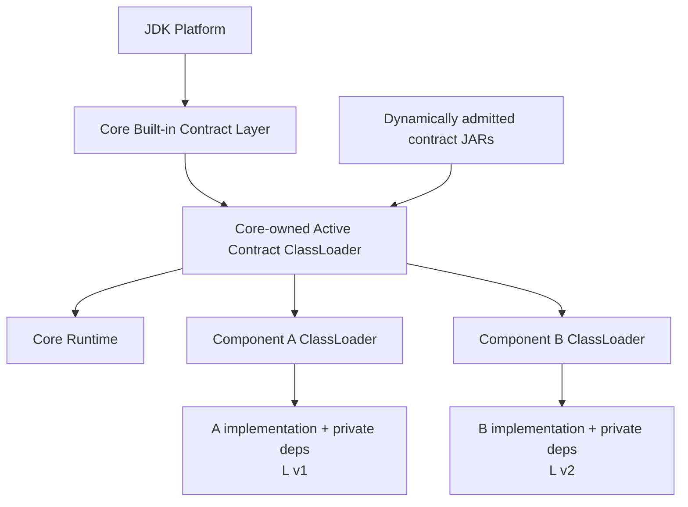

# Application Component Architecture Technical Notes

**Status:** Public technical companion / design notes  
**Companion documents:** `Application-Component-Architecture-Governance.md`, `Application-Component-Capability-Contract-Specification.md`, `Application-Component-Lifecycle-and-Provisioning-Specification.md`
**Normative relationship:** Explanatory unless a section is promoted into a formal runtime/profile specification

---

# I. Why “Component Architecture”

## I.1 Terminology

The architecture started as a plugin-system design, but the capability model is broader.

The useful unit is now:

```text
component
```

because:

- Core participates in the same capability graph;
- plugins are extension components;
- components can consume functionality from Core or other components;
- provider instances are runtime/configuration objects coordinated by Core.

Therefore **Component Architecture** is more precise than **Plugin Architecture**.

## I.2 Plugin remains a packaging/deployment concept

A plugin is still a useful term.

It means an independently installable extension package/component.

The architectural graph, however, should not treat “Core versus plugin” as the main semantic distinction.

The main distinctions are:

```text
consumer
provider definition
provider instance
capability contract
Core coordinator
```

## I.3 Applicability beyond desktop applications

The component model is not inherently a desktop-application architecture. Its essential requirements are a coordinating Core, capability contracts, Core-owned binding/lifecycle state, and a technology profile capable of isolating component runtimes and mediating calls.

It can therefore be applied to:

```text
desktop applications
web applications
server/daemon applications
CLI tools
background workers and services
headless automation hosts
```

The strongest portability is obtained when **presentation ownership remains in Core**. A component can contribute declarative presentation intent through capabilities, for example:

```text
forms
fields and validation metadata
tables and data models
commands/actions
panels/view models
notifications
```

A desktop Core may render those descriptions as Qt/PySide widgets. A web Core may render the same logical contribution as HTML/DOM/client-side views. The component does not need to own the concrete GUI toolkit or browser framework.

This is analogous to the recommended Python/PySide profile: Core owns the UI runtime and event loop, while isolated components contribute models and behavior through contracts. For a web product, Core can similarly own HTTP routing, authentication, session state, HTML/client rendering, and frontend asset policy while components provide capability-driven data and declarative UI contributions.

Arbitrary component-supplied native widgets, JavaScript bundles, routes, templates, or frontend frameworks are possible only under an explicit product/technology profile because they weaken dependency isolation and Core ownership. The general architecture does not require or assume such direct UI injection.

The same component architecture can therefore support different presentation hosts without changing its capability, instance, binding, provisioning, or entitlement model.

## I.4 Reference Application Component Library

The architecture should be implemented once in a reusable framework rather than independently in each product. The reference implementation is **Algites Application Components (AAC)**.

A Python reference package may expose modules conceptually such as:

```text
appcomponents.descriptor
appcomponents.contracts
appcomponents.catalog
appcomponents.instances
appcomponents.binding
appcomponents.resolver
appcomponents.lifecycle
appcomponents.observation
appcomponents.entitlement
appcomponents.runtime
```

The reusable library should own generic mechanics such as descriptor parsing, contract admission, stable provider-instance identity, binding resolution, DAG validation, lifecycle coordination, normalized invocation/observation envelopes, entitlement interfaces, diagnostics, and technology-profile extension points.

Products should supply adapters and product contracts rather than fork those mechanics. A Java implementation may realize the same architecture with different runtime machinery while preserving the same contract identities and governance rules.

The stable framework-owned cross-language namespace is `_AAC.*`; implementation package names are not part of that public identity.

---

# II. Capability Model Rationale

## II.1 Why capability negotiation instead of release gates

A conventional system often says:

```text
Plugin 7 requires Core >= 12.3
```

The Application Component model instead prefers:

```text
consumer supports [1,2,3]
provider supports [2,3,4]
Core active catalog knows [1,2,3]

selected = 3
```

This better reflects actual compatibility.

## II.2 Why Core must own every negotiated contract identity

Allowing two extension components to use a contract that Core has not admitted would undermine Core's role as:

- resolver;
- binding authority;
- compatibility-policy owner;
- diagnostics owner;
- runtime mediator.

It is also technically unsafe in runtimes with explicit type identity, especially Java.

Therefore:

```text
binding version =
    consumer
  ∩ provider
  ∩ Core active contract catalog
  ∩ lifecycle policy
```

## II.3 Built-in versus dynamically admitted contracts

The active catalog does not have to be identical to the contracts originally compiled into a Core release.

It may be:

```text
active contract catalog =
    built-in contract definitions
  + validated dynamically admitted contract bundles
```

This gives an older Core a controlled way to mediate a newer capability contract without allowing plugins to create private, incompatible definitions behind Core.

A dynamically supplied contract must become Core-owned before graph binding.

## II.4 Core knowledge is not Core implementation

Core may know:

```text
algites.object-store/v4
```

because it owns/admitted:

```text
contract metadata
binding types or schemas
DTO definitions
conformance identity
```

without exposing an object-store provider.

An S3 extension component may be the only provider.

## II.5 Canonical contract identity

The same:

```text
capability id + version
```

must not mean two different definitions.

If Plugin A and Plugin B both bundle `algites.object-store/v4`, Core should verify that they identify the same canonical contract artifact/definition.

If the definitions conflict, graph resolution must fail rather than silently picking one.

## II.6 Why finite support sets are important

A component cannot safely claim:

```text
>= 2
```

because future v17 is unknown.

Finite sets make support intentional and testable.

## II.7 Why capabilities can connect extension components

The desirable dependency is:

```text
Deployment consumes algites.object-store
```

not:

```text
Deployment requires S3 Plugin
```

Any conforming provider can satisfy the capability.

## II.8 Operations belong to the capability contract

A capability should be small and cohesive, but it does not need to be artificially reduced to exactly one method.

For example, a secret-store capability may naturally contain:

```text
get
put
delete
exists
```

The operation names are not global. Their full identity is:

```text
capability id + capability version + operation id
```

This lets unrelated capabilities use the same local operation name and lets plugin-supplied contracts introduce new operations without modifying a Core-global enum.

The canonical contract definition should therefore describe the operation list and the normalized request/result/error schemas used by generic tooling.

---

# III. Contextual Configuration Architecture

## III.1 Configuration-scopes are contextual identities, not storage locations

Components should see normalized effective configuration, not storage paths. The physical source may be local files, database records, workspace serialization, a remote service, or another product-defined configuration-provider.

AAC well-known configuration-scope types are:

```text
SYSTEM
USER
WORKSPACE
```

They are not a closed enum. A deployment may add `ORGANIZATION`, `TEAM`, `CUSTOMER`, `CUSTOMER_GROUP`, `TENANT`, `ENVIRONMENT`, or other contextual types.

A configuration-scope type says **which context the value governs**. It does not say where the value lives. For example, `USER(artur)` may come from a remote intranet profile; `WORKSPACE(project-x)` may come from a remote project service; `CUSTOMER(acme)` may come from a mounted share.

## III.2 Fixed-schema bootstrap and configuration profiles

A product ships a fixed bootstrap schema and a safe built-in configuration profile. Trusted installation/bootstrap state may register additional profile sources and configuration-providers without recursively relying on the scoped configuration being constructed.

A configuration profile determines the ordered configuration-scope chain for a particular product usage/workspace and the resolvers/configuration-providers used for each configuration-scope. Therefore the same application can use different chains for different projects without recompiling an enum into the product.

A workspace may select or parameterize a profile only as allowed by higher bootstrap policy. It cannot remove mandatory trusted configuration-scopes or policy authorities imposed above it.

## III.3 Component-declared allowed configuration-scopes

A schema property should declare the configuration-scope types where it may be defined. This prevents nonsensical placement while allowing one provider instance to combine values from many contexts.

Examples include a user-local executable path, workspace repository URL, customer deployment endpoint, organization-wide proxy, and system-level default.

## III.4 Configuration targets and writes

AAC baseline configuration targets are `COMPONENT` and `PROVIDER_INSTANCE`. Component configuration is shared independently of any one instance; provider-instance configuration belongs to one immutable provider-instance GUID. These are separate configuration contracts and do not implicitly inherit into one another.

Configuration mutations travel through Core as normalized change sets, not storage-format YAML/JSON. A change set targets one configuration-scope, configuration-provider, and configuration target and may contain multiple value/policy changes. Writable providers expose technical capabilities such as `WRITE_VALUE` or `WRITE_POLICY`; Core authorization separately decides whether the current principal may use them. Optimistic concurrency prevents accidental overwrite of newer provider state.

## III.5 Configuration-providers are ordered within a configuration-scope

A configuration profile may bind one or more configuration-providers to one concrete configuration-scope. Their priority/merge behavior must be deterministic. Equal-priority conflicting scalar values should be diagnosed rather than resolved by incidental load order.

Local/remote is a configuration-provider characteristic, not a configuration-scope.

## III.6 Policy-modes compose monotonically

The baseline policy-modes are `LOCK`, `MIN`, `MAX`, `IN_SET`, `NOT_IN_SET`, and `DEFAULT`. Multiple policy-modes may apply to one property.

Restricting modes are evaluated from the least-specific configuration-scope toward the most-specific and may only tighten the allowed domain. For example:

```text
ORGANIZATION: MIN(20), MAX(50)
WORKSPACE:    IN_SET([10, 30, 40, 80])

=> effective allowed values = [30, 40]
```

A later `MIN(10)` cannot relax `MIN(20)`; it simply has no broadening effect. Incompatible restrictions that produce an empty domain are a policy conflict.

`DEFAULT(x)` is not a restriction. It is a policy-owned fallback whose provenance remains visible. `LOCK(x)` restricts the property to one value and thereby forces that policy value.

## III.7 Ordinary values resolve in the opposite direction

Once effective policy is known, ordinary values resolve from the most-specific toward the least-specific configuration-scope. The first explicit value wins only if it satisfies effective policy. A violating explicit value is an error, not a reason to silently fall back to an older value.

If no ordinary value is present, the most-specific valid policy `DEFAULT` is used, followed by a valid component-schema default.

## III.8 Provenance matters

Core should retain, per property:

```text
value source kind
configuration-scope type/id
configuration-provider
all effective policy-modes and their provenance
shadowed contributions
policy conflicts/violations
```

This is required for understandable UI and reproducible diagnostics.

## III.9 Configuration is separate from binding

Configuration answers how one provider instance is configured. Binding answers which provider instance a consumer uses. Binding preferences may reuse contextual identities through their own binding-preference scopes, but are not ordinary configuration values.

# IV. Persistent Semantic Extension Data

## IV.1 Configuration versus semantic extension data

Configuration expresses intent used to configure a component/provider. Semantic extension data is component-owned project/domain meaning associated with a Core-managed workspace/entity. Runtime cache is neither.

## IV.2 Static entity-extension declarations

A component should statically declare which Core entity type IDs it extends, whether it only reads the Core entity, whether it stores extension data, the extension schema ID/version, and whether it contributes logical UI. Core can then expose generic extension sections/actions for matching entity types without loading arbitrary plugin implementation code. Extension-data write access does not imply Core-entity write access.

## IV.3 Physical storage belongs to the Core product

AAC should not require `.aac/extensions` or any fixed path. Embedding an opaque extension envelope directly in a Core entity serialization can be excellent for a file-oriented product because Core entity migrations naturally carry the payload. A database-oriented product may instead keep a related extension table/document.

The component should never need to know which representation was chosen.

## IV.4 Opaque migration is the key property

The most important requirement is that Core can move/rename/restructure its own entity storage while preserving unknown extension data even when the plugin is absent. Core understands owner/schema/subject metadata but not plugin semantics.

When a Core migration cannot map extension payloads unambiguously after split/merge/removal, it should preserve/orphan them rather than silently delete them.

## IV.5 Component absence and VCS

A workspace checkout may contain extension data for a component that is not installed, not currently entitled, or incompatible. Core preserves it and reports compatibility state. Plugin-specific interpretation stays disabled until a suitable component is available.

This is why semantic extension data can safely be VCS-portable without making the workspace dependent on the plugin being present during every Core migration.

The normative model is in `Application-Component-Context-Configuration-and-Entitlement-Specification.md`.

# V. Configuration and Data Migration

## V.1 Separate schema version from component version

Do not use:

```text
component version 8.4
```

as the only identifier for persisted data format.

Instead use:

```text
configuration schema id/version
data type id/schema version
```

This lets a component release leave schemas unchanged or migrate several schema generations.

## V.2 Upgrade sequence

Preferred flow:

```text
install new component package

Core reads descriptor:
    readable schema versions
    current writable version
    migration steps

Core inspects stored configuration/data

if migration required:
    stage migration
    validate
    commit

then activate
```

## V.3 Migration execution

The transformation code may be supplied by the component package.

However, Core should invoke it in a controlled migration mode and own:

```text
source snapshot
target staging
validation
commit/rollback
diagnostics
```

The component should not mutate persistent files directly during migration.

## V.4 Configuration cannot be migrated

If configuration cannot be migrated:

```text
preserve old configuration
block affected activation
offer explicit reset/reconfiguration
```

Only after explicit user action should the old configuration be discarded.

## V.5 Semantic data cannot be migrated

This is more serious than ordinary configuration.

Core should preserve the data and require one of:

```text
install compatible component
restore compatible VCS revision
provide migration-capable version
explicitly purge data
```

Automatic “reconfigure from scratch” may not be meaningful.

## V.6 Downgrade

Downgrade is the same compatibility problem in reverse.

A component version must not interpret a newer schema simply because it has the same data type ID.

Explicit readable-version declarations are required.

---

# VI. Provider Resolution

## VI.1 Binding hierarchy

Recommended order:

```text
consumer-instance override
workspace binding
user binding
organization/system binding
qualifier-based rule
sole compatible provider
platform default
user/admin selection
```

## VI.2 Why plugins should not select providers themselves

If the consumer scans providers and selects one internally:

- the UI may not know what is in use;
- configuration cannot reproduce the graph;
- VCS cannot transport the same topology;
- migration cannot reason about references;
- administrator policy can be bypassed.

Therefore Core resolves and injects the provider.

## VI.3 Provider instance versus implementation

This distinction applies universally, not only when several instances happen to exist.

Example:

```text
implementation:
    HashiCorp Vault provider

instances:
    id 62c0...  name Corporate Vault
    id 91d8...  name Test Vault
```

The resolver never binds directly to the implementation definition. It binds to a concrete provider instance ID.

If only `Corporate Vault` existed, the rule would be identical.

## VI.4 Contract negotiation after provider selection

Provider version does not rank provider quality.

Core selects provider first, then contract.

## VI.5 Provider-instance multiplicity is not consumer cardinality

A provider definition may always have several instances. That does not mean a consumer call is automatically broadcast to all of them.

`SINGLE` and `MULTIPLE` describe the **consumer requirement/binding**:

```text
SINGLE
    exactly one provider instance is bound

MULTIPLE
    a resolved collection of provider instances is bound
```

For an operation that must produce one authoritative or transactional result, `SINGLE` is normally appropriate even when many candidate instances exist.

Observer-style functionality is a natural `MULTIPLE` case. For example, a dedicated invocation-observer capability could bind both:

```text
Tracer / stdout
Tracer / vcs-log-file
```

Each tracer is a separate configured instance. The observed VCS operation itself can still remain `SINGLE`, preserving one authoritative VCS result. This avoids pretending that a tracer is a second VCS implementation merely because it observes the same operation.

## VI.6 Why the resolved instance graph is a DAG

A direct self-binding is merely the smallest invalid cycle. The stronger baseline rule is that the entire resolved extension provider-instance dependency graph is acyclic.

This does **not** require the component/provider-definition declaration graph to be acyclic. For example, A may provide X and consume Y while B provides Y and consumes X. If actual bindings resolve `A1 -> B1` and `B2 -> A2`, the runtime graph is still a DAG.

Rejecting concrete cycles simplifies activation and shutdown ordering, transaction reasoning, deadlock analysis, diagnostics, and invocation causality. If a future use case requires safe instance cycles, it should be introduced deliberately as a separately specified profile rather than being accidental baseline behavior.

## VI.7 Observation as a general capability

The observer idea generalizes cleanly if observation itself is a versioned capability.

A product-level observer provider can receive a normalized envelope such as:

```text
invocation id
phase PRE | POST
capability id/version
operation id
consumer identity
provider instance identity
normalized arguments
normalized result or failure for POST
runtime timing/correlation metadata
```

This avoids creating one parallel `...observation` interface for every business capability.

## VI.8 Why operations must be contract metadata

An observation binding may want to say:

```yaml
capability: example.vcs.repository
operations: [commit, push]
phases: [PRE, POST]
```

The strings `commit` and `push` are interpreted by looking at the canonical `example.vcs.repository` contract. There is no global list containing all operations from every capability.

This becomes especially important for a capability introduced by a third-party plugin. Once Core admits that capability's canonical contract bundle, Core also learns its operation set and can validate observation selectors without having known those operation names at build time.

## VI.9 Observer configuration versus observation binding

A tracer instance might contain:

```text
output = stdout
pretty_print = true
```

while Core-owned topology separately says:

```text
observe every capability, PRE + POST
```

or:

```text
observe example.vcs.repository/commit, POST only
```

Keeping these separate follows the same rule as normal provider binding: a component defines how an instance behaves, while Core owns where the instance participates in the system graph.

## VI.10 Read-only semantics

A generic observer should not return modified arguments, modified results, or an allow/deny decision.

Conceptually:

```text
observe(event) -> acknowledgement only
```

If an observer fails, Core records an observer diagnostic. The original operation's success or failure remains the provider's authoritative result.

An interceptor capable of modifying or vetoing calls would be a distinct architectural contract.

## VI.11 PRE and POST

Two phases are sufficient for the baseline model:

```text
PRE
POST
```

`POST` includes either a success result or structured failure, so a separate ERROR phase is unnecessary unless a future contract has a concrete need for one.

## VI.12 Recursion and sensitive data

The generic observation capability `_AAC.capability.observation` must never observe observation-delivery calls. This remains an explicit meta-capability safety rule in addition to the resolved extension-instance DAG invariant: framework observation dispatch must not recursively generate observation events for its own delivery calls.

A wildcard therefore means conceptually:

```text
all observable capability invocations
minus observation delivery itself
```

Core must also normalize and redact sensitive contract fields before dispatch. A stdout tracer should never accidentally print a password or access token merely because the observed business operation accepts one.

The detailed normative model is specified in `Application-Component-Capability-Contract-Specification.md`.

---

# VI.A Core Invocation Bridge and Entitlement Runtime Semantics

## VI.A.1 Consumers never call provider implementations directly

Even for an in-process Python or Java profile, the consumer receives a Core-owned capability handle/proxy. Core mediation is what makes tracing, version identity, process/subinterpreter transport, normalized errors, timeout/cancellation, and entitlement remediation consistent across runtime profiles.

An in-process implementation can be fast, but bypassing Core would create different semantics from process/remote providers and would prevent central handling of permission failures.

## VI.A.2 Entitlement is provider-owned permission semantics over Core-validated evidence

Core validates entitlement evidence; one verified entitlement document may contain grant sections for multiple components sharing one issuer/scope/subject. Core extracts and validates the relevant component entries and supplies each runtime an effective permission/constraint context grouped by provided capability ID/version. Permission identity is `(component_id, capability_id, capability_version, permission_id)`. The provider interprets its own strings (`WRITE`, `EXPORT`, etc.) within that capability/version namespace. Consumers do not know or request those tiers; they know only the capability contract they consume.

Core also carries effective validity/expiry and grant provenance per permission, including the source entitlement document/bundle and component entry where useful, and refreshes the provider context when grants expire, are revoked, or are refreshed. This allows an unlicensed provider to expose basic/configuration/diagnostic behavior and reject only restricted actions. A bundle document is not exploded into separate trust objects merely because it contains several components: signature/issuer/scope/subject evidence remains document-level, while applicability and descriptor validation remain component-entry-level.

## VI.A.3 Central permission remediation

When the provider returns standardized `PERMISSION_DENIED`, the bridge can refresh entitlement, invoke product licensing UI, obtain a new grant for an entitlement-scope type accepted by that provided capability version and a trusted matching subject identity, update the provider context, and optionally retry.

Transparent retry is allowed only if the failure is explicitly marked safe after entitlement change or contract idempotency makes repetition safe. Otherwise Core can finish the licensing flow but must ask the caller/user to repeat the operation.

## VI.A.4 Bindings are stable across ordinary permission changes

Changing a provider permission set should not normally rebuild the capability graph. The binding still points to the same provider implementing the same contract; runtime authorization determines whether the current invocation is allowed.

---

# VII. Resolution, Wiring, and Cycles

## VII.1 Read all descriptors first

Static descriptors let Core compute the graph without executing business logic.

## VII.2 Declarative cycles versus resolved instance cycles

The declaration:

```text
A provides X, consumes Y
B provides Y, consumes X
```

is valid because it describes capability relationships, not concrete runtime edges.

After instance selection, Core may obtain an acyclic graph such as:

```text
A1 -> B1
B2 -> A2
```

That is valid. A concrete graph such as `A1 -> B1 -> A1` is rejected before activation.

## VII.3 Staged activation

Discovery, verification, contract admission, provisioning, entitlement evaluation, resolution, instantiation, wiring, readiness, activation, suspension, and shutdown are separate lifecycle concerns. The normative stage model is defined by `Application-Component-Lifecycle-and-Provisioning-Specification.md`.

## VII.4 Construction rule

Constructors/bootstrap creation should not make mandatory business calls to peer components.

Provider objects should be constructible before the graph is operational.

## VII.5 Binding object

Conceptually a Core binding contains:

```text
consumer identity
capability id
contract version
provider instance id
invocation endpoint/reference
```

Its runtime representation is technology-specific.

---

# VIII. Dependency Isolation

## VIII.1 Why it is mandatory

Without isolation:

```text
A -> Library L v1
B -> Library L v2
```

can break an otherwise valid capability graph.

## VIII.2 Why not resolve one global package closure

Doing so would effectively embed package-manager semantics for every supported ecosystem into Core.

Isolation is a simpler architectural contract.

## VIII.3 Not a security sandbox

Class loaders and subinterpreters isolate dependencies/state but should not be sold as a hostile-code sandbox.

---

# IX. Python Runtime Notes

## IX.1 Baseline: CPython 3.13+ with multiple runtime profiles

The reusable Python binding should support **CPython 3.13 or newer** as its baseline. The baseline does not require subinterpreters. AAC distinguishes runtime profiles:

```text
IN_PROCESS
    trusted/lightweight provider runs as a Python object in the Core interpreter

PROCESS
    provider instance runs in its own persistent child process
    available on the 3.13+ baseline

SUBINTERPRETER
    provider instance runs in a CPython subinterpreter
    optional Python 3.14+ profile
```

`PROCESS` is the portable dependency-isolation profile when private dependencies, native-extension incompatibility, crash containment, or language independence matter. `SUBINTERPRETER` is a lighter optimization profile where the runtime and dependencies are known to be compatible.

## IX.2 Provider-instance runtime ownership

Runtime isolation is realized per **provider instance**, not merely per provider definition. If one provider definition has instances `A1` and `A2`, their configuration/lifecycle state is independent. Under `PROCESS`, Core therefore owns two persistent process handles:

```text
Provider definition A
    A1 -> child process P1
    A2 -> child process P2
```

The default profile does not multiplex several provider instances into one child process. A future explicit shared-process profile could be specified separately if a concrete need justifies the additional failure/configuration coupling.

## IX.3 Persistent process profile

A process runtime is started during `INSTANTIATE` and normally remains alive until `DEACTIVATE`. Core owns the process handle, IPC channel, timeout/error state and endpoint registration. The provider process receives only its own instance identity/configuration and the resolved capability proxies injected during `WIRE`.

Conceptually:

```text
Core                                      Provider process
  |                                             |
  |-- bootstrap(instance + configuration) ---->|
  |-- wire(binding descriptors) -------------->|
  |-- ready ---------------------------------->|
  |-- activate -------------------------------->|
  |                                             |
  |-- invocation ----------------------------->|
  |<----------------------------- result/error |
  |                                             |
  |<-- core_invoke(requirement, operation) -----|
  |-- core_response -------------------------->|
  |                                             |
  |-- deactivate ----------------------------->|
  |-- shutdown -------------------------------->|
```

The reference Python profile uses a persistent JSON-lines control protocol. Requests carry correlation IDs. Normalized `InvocationInput` / `InvocationOutput` values cross the boundary; arbitrary Python implementation objects do not. A non-Python executable may implement the same wire protocol.

A provider definition may select the profile declaratively, for example:

```yaml
providers:
  - id: audit
    capability:
      id: _AAC.capability.observation
      version: 1
    implementation_class: example.audit:AIcAuditProvider
    runtime:
      profile: PROCESS
```

For the reference Python binding, omission of `runtime.command` means that Core starts the standard AAC Python process host using the selected Python executable. A profile may instead declare an explicit command/environment to enter a component-private Python environment or a different executable implementing the AAC process protocol.

Provider code may call a consumed capability from the child process. The process-local capability handle sends a reverse request to Core identifying the already injected requirement/handle. Core performs the normal invocation against the already-resolved provider instance. This preserves centralized binding/version/observation policy.

The resolved provider-instance graph is a DAG before activation. That invariant is especially useful for process runtimes because nested capability calls cannot form a binding cycle that deadlocks a chain of mutually waiting child processes.

The baseline process profile may serialize requests per provider instance while allowing different provider-instance processes to execute concurrently. More advanced multiplexing can be added without changing capability contracts.

## IX.4 Process streams

The reference JSON-lines Python host reserves its control stdout for protocol frames and redirects provider standard output to a diagnostic stream controlled by Core. Products may provide richer stream routing, logging, structured diagnostics, sockets or other transports, but component code MUST NOT be allowed to corrupt the control channel.

## IX.5 Private environments

A process command may point to the product Python executable or to a component-private environment. The latter allows a provider to use private Python/native dependencies without placing them in Core's environment. The provider package still depends on the shared AAC language-binding surface required by its process host/protocol.

## IX.6 Optional CPython 3.14+ subinterpreter profile

Python 3.14 added the public standard-library `concurrent.interpreters` API. A `SUBINTERPRETER` profile may use one private interpreter per provider instance while keeping Core and all interpreters inside one OS process.

Subinterpreters isolate import/module state and can be lighter than OS processes, but they are not a hostile-code security boundary. Not every third-party native extension is safe in multiple interpreters; incompatible providers must use another supported profile rather than silently weakening isolation.

## IX.7 Core active contract catalog representation in Python

The Python Core owns the canonical schema/binding definition for every capability version in its active catalog. The active catalog may combine built-in contracts and validated contract bundles supplied by extensions. Cross-runtime proxies operate from these Core-owned definitions.

## IX.8 Consumer-side handles/proxies

A consumer receives only handles for providers selected during graph resolution. It does not receive unrestricted discovery authority. In-process handles may call Core directly; process/subinterpreter handles proxy normalized invocation requests across their runtime boundary.

## IX.9 Configuration and data delivery

Core delivers component-target and provider-instance-target effective configuration as separate normalized objects, plus only declared/allowed semantic data contexts. The component does not need to know the physical persistence format. Unsupported/newer semantic data remains Core-owned and preserved.

## IX.10 Native extension considerations

Process isolation naturally handles dependencies that are unsafe in multiple interpreters because each provider instance owns an independent OS process. Subinterpreter compatibility must be explicitly validated for third-party native extensions.

## IX.11 GUI recommendation

Keep the primary GUI/web rendering implementation in Core/product-owned code for the baseline. Extension components contribute logical form/panel/data/action descriptions and callbacks through capabilities. Reusable AAC UI artifacts are now defined separately: `aac/uiintf` provides toolkit-neutral view/form/controller contracts and `aac/uiqt` provides the baseline PySide6 renderer. Arbitrary framework-native widget objects still do not cross process/interpreter boundaries.

## IX.12 Performance

Process isolation costs additional memory, startup and serialization but provides stronger crash/native-library isolation. Subinterpreters can reduce those costs where supported. Products should measure startup, per-instance memory, invocation latency and shutdown/restart rather than assuming one profile is universally superior.

---

# X. Java Runtime Notes

## X.1 One extension-component class loader per component

The natural Java model is a dedicated class loader for each extension component.

The contract layer is separate from plugin-private implementation libraries:



The exact loader hierarchy may vary, but every capability type used across component boundaries must resolve from one Core-owned shared contract domain.

## X.2 Java runtime type identity

In Java, a class or interface is determined at runtime by:

```text
binary class name
+
defining ClassLoader
```

Therefore:

```text
PluginAClassLoader -> Interface_v4
PluginBClassLoader -> Interface_v4
```

creates two distinct runtime types if each loader defines its own copy.

Even byte-for-byte identical class files are not interchangeable when defined by different class loaders.

This is the technical reason a cross-component capability contract cannot remain private to each component.

## X.3 Parent-first delegation is the desired baseline

The normal Java class-loader delegation model is parent-first:

```text
loadClass(name):
    1. return already loaded class if present
    2. ask parent
    3. if parent cannot load it, use findClass()
```

Algites should preserve parent-first behavior for protected shared contract namespaces.

For a contract already present in the Core-owned active contract layer:

```text
Component loader asks for VcsStatusV3
->
parent has VcsStatusV3
    ->
the shared Core-owned VcsStatusV3 Class object is used
```

Plugin-private dependency namespaces may use a different child/private policy when required, but shared Algites contract packages must never be shadowed.

## X.4 Why plugin-local fallback is insufficient for cross-component contracts

Suppose an old Core contains only:

```text
Interface_v1
Interface_v2
Interface_v3
```

and Plugin A bundles `Interface_v4`.

If Plugin A's private loader simply falls back to its local `Interface_v4`, Plugin A can potentially load a private implementation:

```java
final class ProviderA implements InterfaceV4 {
    ...
}
```

But Plugin B doing the same obtains a different runtime `InterfaceV4` type.

Therefore:

```text
PluginA::InterfaceV4 != PluginB::InterfaceV4
```

and a provider object from A cannot safely be passed to B as B's private `InterfaceV4`.

This local fallback can make a class loadable **inside one plugin**, but it does not create cross-component interoperability.

## X.5 Contract JARs may be distributed with a component package

Where a version number is encoded in a physical file or artifact name, these specifications use an underscore before the complete version suffix, for example `algites-vcs-status_4.jar` or `git-repository-config_1.yml`, rather than forms such as `algites-vcs-status-v4.jar`. This naming convention makes the version suffix visually and mechanically separable from the logical base name. It applies to physical artifact/file naming; logical contract identity remains represented by separate capability/schema ID and version fields, and explanatory shorthand such as `X/v4` may still be used when discussing a logical contract version.

A new component may need to support a capability contract newer than the Core's built-in contracts.

Its distribution may therefore include the canonical contract JAR, for example:

```text
git-component-package/
    descriptor.yml

    contracts/
        algites-vcs-status_4.jar

    implementation/
        git-component.jar

    lib/
        jgit-...
        other-private-dependency-...
```

The important rule is:

> the contract JAR is distributed *with* the component, but it is not treated as a private plugin dependency when used for cross-component binding.

Before any implementation class that relies on that contract is loaded, Core must decide whether to admit the contract bundle into the shared active contract layer.

## X.6 Contract admission before component class-loader creation

Because all descriptors are discovered before activation, Core can collect required/supplied contract bundles first.

Recommended sequence:

```text
1. read all component descriptors
2. discover contract bundles
3. validate capability id/version identity
4. validate integrity/trust policy
5. deduplicate identical canonical bundles
6. reject conflicting definitions
7. build/finalize Core Active Contract ClassLoader
8. create component class loaders with Active Contract ClassLoader as parent
9. resolve graph
10. load selected implementation classes
```

A Core implementation may realize the active contract domain with one loader, a loader layer, or an equivalent mechanism.

The architectural requirement is one shared defining domain for cross-component contract classes.

## X.7 Built-in contracts plus dynamically admitted contracts

An old Core may start with:

```text
built-in:
    VcsStatusV1
    VcsStatusV2
    VcsStatusV3
```

A newer component supplies canonical:

```text
VcsStatusV4 contract JAR
```

If the Core bootstrap/runtime understands generic contract admission, it can add v4 to the **active** contract layer before component class loaders are created.

The Core then effectively knows/mediates:

```text
V1
V2
V3
V4
```

even though the old Core binary did not originally contain a V4 implementation.

Core still does not necessarily provide the capability itself.

## X.8 Same contract version supplied by multiple components

Plugin A and Plugin B may both package the same canonical v4 contract JAR for self-contained distribution.

Core should treat this as duplicate supply of one contract, not two contract identities.

Conceptually:

```text
A supplies capability X/v4, digest D
B supplies capability X/v4, digest D
    -> admit once

A supplies capability X/v4, digest D1
B supplies capability X/v4, digest D2
    -> contract-definition conflict
```

The exact identity mechanism may use:

- signed artifact coordinates;
- immutable contract artifact ID;
- content digest;
- namespace authority metadata;
- a combination of these.

## X.9 Compile-time API and distribution packaging are separate questions

A Java component may compile against an Algites contract artifact as:

```text
compileOnly / provided
```

from the perspective of its **implementation JAR**.

However, a self-contained component distribution may still package the canonical contract artifact separately under a contract-bundle area so an older compatible Core can admit it dynamically.

Thus:

```text
implementation runtime class path:
    does not privately define shared contract classes

component distribution:
    may carry canonical contract JARs for Core admission
```

This resolves the apparent contradiction between `provided` compilation and forward-compatible distribution.

## X.10 Protected shared namespaces

Algites should reserve protected shared namespaces, for example:

```text
eu.algites.bootstrap.*
eu.algites.capability.*
eu.algites.contract.*
```

A component-private class loader MUST NOT define a private replacement for a class belonging to a protected contract namespace used in cross-component communication.

If such a class is required:

```text
it must already be in the active contract layer
or
its canonical contract bundle must be admitted there first
```

## X.11 The old-Core loading problem

Suppose a new component contains:

```java
final class StatusV3Provider implements VcsStatusV3 { ... }
final class StatusV4Provider implements VcsStatusV4 { ... }
```

If an old Core cannot or does not admit v4, it may still run the component through v3 **provided it never loads a class whose linkage requires VcsStatusV4**.

The robust rule is:

> Any class that must be loadable on an older Core must avoid symbolic references to contract types that are not present in that Core's active contract layer.

Do not create one bootstrap class:

```java
final class GitComponent
        implements VcsStatusV3, VcsStatusV4 {
    ...
}
```

because loading/linking that class requires both interfaces.

## X.12 Version-specific implementation classes

Implementation classes should be separated by contract version or compatible generation.

Descriptor concept:

```text
algites.vcs.status/v3
    implementation:
        ...StatusV3Provider

algites.vcs.status/v4
    implementation:
        ...StatusV4Provider
```

If v4 was not admitted:

```text
Core selects v3
loads StatusV3Provider
does not load StatusV4Provider
```

If v4 was admitted and negotiated:

```text
Core selects v4
loads StatusV4Provider
```

Version-specific classes may live in separate internal JARs/modules for stronger linkage isolation.

## X.13 Bootstrap classes must reference only stable bootstrap contracts

The Java bootstrap entry point must not directly reference every capability interface shipped anywhere in the component package.

It should depend only on the small stable bootstrap API and static descriptor model.

That lets Core inspect/admit contracts and resolve versions before touching version-specific provider classes.

## X.14 Shared DTO types

All types appearing in a shared capability interface signature must also resolve through the same Core-owned active contract domain, unless they are explicitly safe JDK/platform types.

Bad:

```java
ThirdPartyPrivateType status(...);
```

Good:

```java
AlgitesRepositoryStatus status(AlgitesRepositoryRef ref);
```

where both DTOs belong to the admitted canonical contract bundle.

## X.15 Core-supplied Java bindings

Core resolves:

```text
Consumer B
    consumes algites.vcs.status/v4

Provider A
    provides algites.vcs.status/v4
```

After v4 is present in the active shared contract layer:

```text
Provider A concrete implementation
    loaded by A's private class loader
    implements shared VcsStatusV4

Consumer B
    loaded by B's private class loader
    sees the exact same shared VcsStatusV4 Class object
```

Core can therefore inject the provider reference through the shared interface.

B does not need visibility of A's implementation class or private dependencies.

## X.16 Suggested Java component context

Conceptually:

```java
public interface ComponentContext {
    <T> T capability(CapabilityKey<T> key);
    ComponentConfiguration configuration();
}
```

The `CapabilityKey<T>` and shared contract interface `T` must themselves resolve from Core-owned shared contract/bootstrap layers.

Core supplies the already-resolved provider.

The consumer does not choose a provider by scanning component class loaders.

## X.17 Java provider instances

Every Java provider definition is used through Core-managed provider instances. Several instances may expose separate runtime objects implementing the same shared contract:

```text
S3Provider(instance-id-A, prod-config)   implements ObjectStoreV4
S3Provider(instance-id-B, backup-config) implements ObjectStoreV4
```

Core creates each instance using its stable Core-generated ID and separate normalized configuration, then binds consumers to the selected instance ID. A provider with only one instance follows exactly the same path.

## X.18 Java declaration cycles and instance-DAG resolution

Java components may declare mutually complementary capability requirements:

```text
A provides X, consumes Y
B provides Y, consumes X
```

Core still discovers both descriptors and may create both component class loaders. The resolver, however, MUST NOT wire concrete provider objects so that the extension-instance graph becomes cyclic.

A valid resolution may bind `A1 -> B1/Y` and independently `B2 -> A2/X`. An attempted wiring `A1 -> B1/Y` plus `B1 -> A1/X` is rejected before the ready/activation barrier.

This keeps class-loader construction independent from runtime dependency cycles and makes the resolved Java invocation topology a DAG.

## X.19 Parent-first versus child-first for private libraries

Protected contract namespaces are always parent-first.

Plugin-private libraries may use child-first/private resolution if needed so:

```text
Component A -> Library L v1
Component B -> Library L v2
Core        -> Library L v3
```

can coexist.

Conceptually:

```text
if class belongs to protected Algites contract/bootstrap namespace:
    parent/shared domain only
else:
    component-private policy may prefer private loader
```

## X.20 Native/JNI caveat

Class-loader isolation does not automatically isolate native libraries.

Incompatible JNI dependencies may still require:

```text
restricted combinations
renamed native libraries
or process isolation
```

A formal Java profile must define this explicitly.

## X.21 JPMS

JPMS may complement class-loader isolation but does not replace:

```text
Core active contract catalog
shared contract type identity
provider resolution
configuration ownership
lifecycle
```

## X.22 Why this matches the general governance model

The Java runtime behavior explains the language-neutral invariant directly:

```text
a capability contract may be distributed by an extension component
but
it must become Core-owned/shared before cross-component binding
```

Without that step, two plugins can carry the same interface name but still have incompatible runtime types.

Thus Java class-loader semantics are not merely an implementation detail; they are a concrete example of why the general Core-owned active contract-domain rule exists.

---

# XI. Cross-Technology Binding Model

## XI.1 Common conceptual binding

Every binding has:

```text
consumer identity
capability id
selected provider instance
selected contract version
canonical Core-owned contract identity
Core binding metadata
runtime invocation endpoint
```

## XI.2 Java

The consumer can receive a Core-created proxy/handle implementing the shared parent-loaded Java capability interface. Even when the provider is in the same JVM/class-loader topology, the proxy keeps Core mediation in the call path; the consumer does not receive the provider implementation object directly.

## XI.3 Python

The consumer receives a Core-owned handle/proxy exposing the capability operations. The handle dispatches through Core to an in-process, process-isolated, subinterpreter or other provider endpoint according to the selected runtime profile.

## XI.4 Why Core owns the binding configuration

Provider assignment affects:

```text
topology
configuration reproducibility
VCS portability
diagnostics
permissions
contract selection
runtime creation
```

Therefore it cannot be a private consumer setting.

---

# XII. UI Notes

## XII.1 Component administration

A useful generic UI can show:

```text
Component identity/version
Component configuration schema/version

Consumes:
    capability
    selected provider instance
    selected contract version
    binding-preference scope/source

Provides:
    provider definitions
    provider instances
    stable instance ids/names
    active instance state

Persistent data:
    data types
    schema versions
    compatibility state
```

## XII.2 Editing provider binding

The same view may make the resolved provider:

```text
editable
read-only
admin-only
policy-locked
```

depending on product rules.

The representation should not imply that the binding is stored in the component's own configuration.

---

# XIII. Process Isolation Runtime Profile

Process isolation is a first-class AAC runtime profile, not merely a future fallback. It is especially useful for native/private dependencies, crash containment and mixed-language providers.

The baseline profile creates **one persistent process per provider instance**. Core owns each process handle and the corresponding invocation endpoint for the provider instance lifetime. This intentionally mirrors the Core-owned provider-instance model: different instance configuration implies independent runtime state and independent lifecycle.

The profile costs additional memory, startup, IPC and serialization. Those costs are accepted in exchange for a clear dependency/failure boundary. Products may select lighter profiles for compatible trusted providers, but MUST NOT silently merge independent provider instances into one process or bypass the Core-resolved binding graph.

---

# XIV. Lifecycle and Provisioning Notes

The normative lifecycle is defined by `Application-Component-Lifecycle-and-Provisioning-Specification.md`. These notes retain only the design rationale:

- package installation is not the same as provisioning;
- provisioning is not the same as entitlement;
- entitlement is not the same as compatibility;
- graph resolution is not the same as activation;
- suspension/deactivation should be diagnosable separately from contract incompatibility;
- persistent configuration and semantic data may outlive the installed or entitled component version and therefore must remain Core-managed;
- an entitlement change should not silently corrupt an in-flight transaction; Core should apply the lifecycle policy at a defined invocation boundary.

This separation lets UI and diagnostics explain *why* a component is unavailable rather than reporting one generic "plugin failed" state.

---

# XV. Relationship to Established Technologies

## XV.1 OSGi

OSGi is relevant for capabilities, requirements, and wiring.

Algites intentionally keeps the baseline resolver narrower and handles private library dependencies through runtime isolation.

## XV.2 COM-style contracts

COM demonstrates the value of explicit interface contracts rather than relying solely on implementation version.

## XV.3 Protocol version negotiation

Selecting a mutually supported known contract resembles protocol negotiation.

## XV.4 Java class loaders

Java class loaders provide a mature mechanism for:

```text
shared parent API
+
private child implementation/dependencies
```

## XV.5 Python subinterpreters

CPython 3.14's public multiple-interpreter API makes interpreter isolation a practical candidate for a formal Algites Python component profile.

---

# XVI. Proposed Conformance Tests

## XVI.1 Cross-component graph tests

Test:

- Core provider;
- plugin provider;
- plugin-to-plugin chain;
- declarative component-level cycle with acyclic instance resolution;
- global provider binding;
- consumer override;
- ambiguous `SINGLE`;
- `MULTIPLE`;
- provider instance deletion protection;
- binding persistence by immutable instance ID across instance rename;
- initial `default` instance name does not act as identity;
- Core active-contract-catalog ceiling;
- dynamically admitted contract bundle;
- duplicate identical contract bundle;
- conflicting definitions of the same capability/version;
- retired contract;
- optional missing capability.

## XVI.2 Configuration tests

Test:

- component configuration;
- instance configuration;
- fixed-schema bootstrap/profile loading;
- different configuration-scope chains for different workspaces;
- custom configuration-scope types such as CUSTOMER/TEAM/ORGANIZATION;
- multiple configuration-providers within one configuration-scope;
- deterministic equal-priority conflict handling;
- monotonic MIN/MAX/IN_SET/NOT_IN_SET/LOCK composition;
- policy conflict producing an empty domain;
- policy DEFAULT provenance;
- explicit value violating effective policy;
- normalized injection;
- config schema migration;
- missing migration;
- reconfiguration path;
- secret reference handling without assuming WORKSPACE means Git storage.

## XVI.3 Persistent data tests

Test:

- supported schema;
- component absent;
- stored schema newer than installed component;
- migration;
- downgrade;
- VCS round-trip;
- opaque preservation;
- reference integrity.

## XVI.4 Python profile tests

Test:

- Core bridge/proxy mediation even for in-process providers;
- persistent process per provider instance for the PROCESS profile;
- two instances of one provider definition receive independent runtime state;
- reverse process-to-Core consumed-capability invocation;
- parent-invocation propagation across process boundaries;
- conflicting private dependencies;
- scoped effective configuration injection;
- entitlement-context update and standardized permission denial;
- resolved-instance cycle rejection;
- optional CPython 3.14+ subinterpreter profile when available;
- native extension compatibility/certification.

## XVI.5 Java profile tests

Test:

- built-in contract layer plus dynamically admitted contract JAR;
- common Core-owned active contract class loader;
- separate component class loaders;
- conflicting private library versions;
- Core-created proxy/handle through the shared interface, with no direct provider object exposure;
- old Core + new component using old interface class;
- ensure v4 implementation class is not loaded when old Core selects v3;
- reject plugin-private shadow copy of shared API;
- rejection of cyclic provider-instance wiring;
- one and multiple provider instances through the same runtime path;
- provider-instance binding by stable ID;
- JNI/native restrictions.

---

# XVII. Technology References

## XVII.1 Python

Relevant CPython documentation:

- Python 3.14 `concurrent.interpreters`:  
  https://docs.python.org/3.14/library/concurrent.interpreters.html
- Python 3.14 release notes:  
  https://docs.python.org/3.14/whatsnew/3.14.html

Important points for this architecture:

- `concurrent.interpreters` was added in Python 3.14;
- interpreters are isolated execution contexts with independent import state;
- they remain in one OS process;
- not every third-party extension supports multiple interpreters.

## XVII.2 Java

Relevant Java documentation:

- Java SE `ClassLoader`:  
  https://docs.oracle.com/en/java/javase/26/docs/api/java.base/java/lang/ClassLoader.html
- JVM Specification, Loading/Linking/Initializing:  
  https://docs.oracle.com/javase/specs/jvms/se26/html/jvms-5.html

Important points:

- class identity includes the defining class loader;
- custom class loaders have explicit parents and ordinary delegation semantics;
- linking includes direct superinterfaces of a loaded class;
- symbolic reference resolution may be lazy or eager;
- therefore classes intended to load on an old Core must avoid symbolic references to unavailable newer shared APIs.

---

# XVIII. Open Formalization Work

## XVIII.1 Candidate public specifications

The architecture would benefit from separate specifications for:

- component descriptor schema;
- capability contract schema (now initially formalized in `Application-Component-Capability-Contract-Specification.md`);
- Core active contract catalog and dynamic contract-bundle admission;
- configuration-scope/configuration-provider/bootstrap-profile/policy representation (formalized in `Application-Component-Context-Configuration-and-Entitlement-Specification.md`);
- provider-instance schema;
- binding schema;
- semantic extension-data envelope and Core persistence adapter contract (partially formalized in `Application-Component-Context-Configuration-and-Entitlement-Specification.md`);
- migration protocol;
- Python runtime profile;
- Java runtime profile;
- process runtime profile;
- package-management/source/provenance specification;
- entitlement-remediation provider/UI contracts beyond the baseline context model.

## XVIII.2 Promotion rule

A technical mechanism should become a formal public runtime/profile commitment when:

1. it has been implemented or experimentally validated;
2. compatibility implications are understood;
3. conformance tests exist;
4. third-party authors can reasonably rely on it;
5. Algites is prepared to support the published behavior.

## XII.3 AAC reusable UI artifacts

The Python AAC baseline separates UI contracts from the renderer:

```text
coreintf <- uiintf
coreintf <- coreimpl
uiintf + coreimpl <- uiqt
```

`uiintf` exposes normalized administration models and `AIiAacUiController`. `uiqt` maps registered JSON Schema properties to Qt editors, shows unresolved requirements as well as resolved topology, and stores provider selections as GUID-based Core binding preferences. The product owns QApplication/event-loop/window integration. Package installation UI is intentionally deferred until package-store semantics are defined.
